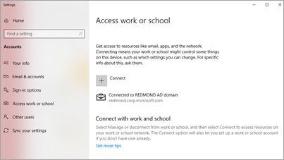
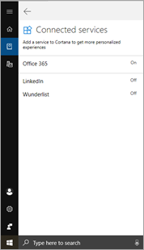

# Enterprise skills FAQ

### What markets (locales) are supported?

Currently, Cortana Skills supports the U.S. market only (en-US locale). 

### How do I get the Tenant ID of my organization?

There are several ways.  Using the Azure portal,

1. Click on the the Azure Active Directory blade.
1. Click on the Properties blade.
1. Click the `Copy` button on the `Directory ID`.

Or you can hover your cursor over user information in the top right of the portal, and write down the information in parentheses on “Directory” beside your tenant name.

### How do I get the Object ID of a user?

Using the Azure portal:

1. Click on the Azure Active Directory blade.
1. Find the accounts you need the ID for (and make sure they are Azure AD accounts).
1. Click on them, one at a time.
1. You will see an info panel – the second section is titled “Identity” and you will see a copy button for `Object ID`.

### My skill name isn’t being recognized by Cortana.

There is a bug in switching between Microsoft (personal) Accounts (MSAs)and AAD Accounts due to cached credentials. See the [Known Issues](../skills/known-issues.md#skill-invocation-name-is-not-recognized) page for more details.

### I can’t see my Calendar or discover skills.

If you type “accounts” via the search bar, you are presented with the control panel where you can select `Access work or school` to make sure you are connected to the right domain.

Then, to get access to your calendar, you need to go to your Cortana notebook. Click on `Manage Skills`, then `Connected services`, and make sure that you are connected to Office365.

