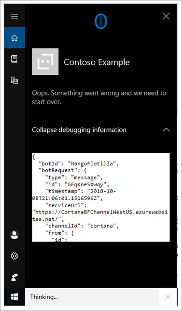
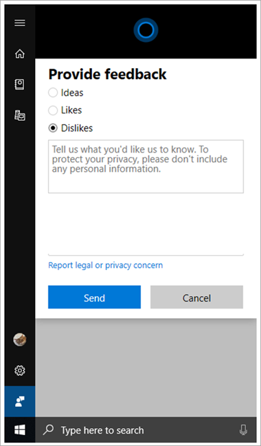

# Testing and debugging enterprise skills

When your skill has been deployed to the Cortana Channel under Default Settings, you will be able to trigger the skill by saying any of your skills invocation names. For example, you might say, "Hey Cortana, ask [invocation name]."

For self or group publish, you can debug issues by using `Run Cortana in Debug Mode` when enabled from the Cortana Channel Page. **<Is it obvious how to run in debug mode, or do we need to explain where they would invoke this?>**

 When you use your skill, you will see an expander titled Expand/Collapse debugging information that when clicked will show the JSON channel data and message payload.

There are resources available to allow you to perform local box testing (including source level debugging via your IDE.)

- [Debug with the emulator](https://docs.microsoft.com/en-us/azure/bot-service/bot-service-debug-emulator?view=azure-bot-service-3.0) describes how to set up the bot emulator for testing. This is part of the bot framework, so it's not specific to Cortana.
- [Debug any Channel locally using ngrok](https://blog.botframework.com/2017/10/19/debug-channel-locally-using-ngrok/) describes how you can use ngrok to forward traffic to your local machine by changing the Messaging Endpoint. This is also not specific to Cortana.

If you run into something you can't fix, and believe the problem is with Cortana or the Enterprise Skills Kit, please click the feedback icon and send us feedback.

