# Cortana design guidelines

These guidelines and recommendations describe how your app can best use Cortana to interact with the user, help them accomplish a task, and communicate clearly how it's all happening.

<!-- Cortana enables applications running in the background to prompt the user for confirmation or disambiguation, and in return provide the user with feedback on the status of the voice command. The process is lightweight, quick, and doesn’t force the user to leave the Cortana experience or switch context to the application. -->

While the user should feel that Cortana is helping to make the process as light and easy as possible, you probably want Cortana to also be explicit that it's your app accomplishing the task.

We use a trip planning and management app named **Adventure Works** integrated into the Cortana UI, shown here, to demonstrate many of the concepts and features we discuss.

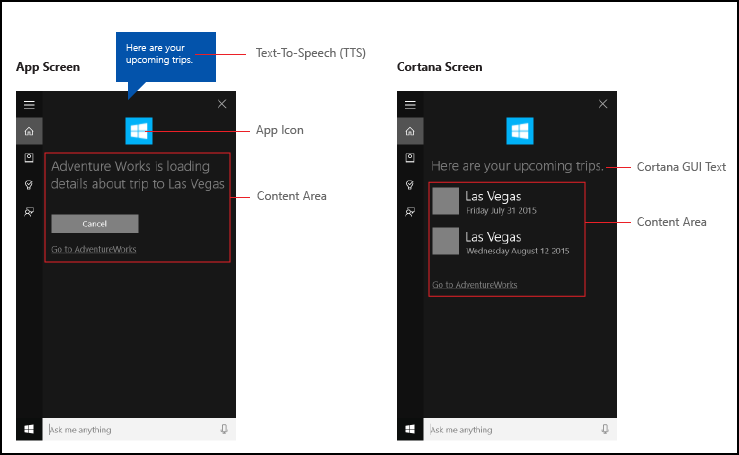

## Conversational writing

Successful Cortana interactions require you to follow some fundamental principles when crafting text-to-speech (TTS) and GUI strings.

| Principle |   | Bad example | Good example |
|---|---|---|
| **Efficient**  | Use as few words as possible and put the most important information up front.| Sure can do, what movie would you like to search for today? We have a large collection. | Sure, what movie are you looking for? |
| **Relevant** | Provide information pertinent only to the task, content, and context. | I’ve added this to your playlist. Just so you know, your battery is getting low. | I’ve added this to your playlist. |
| **Clear** | Avoid ambiguity. Use everyday language instead of technical jargon. | No results for query "Trips to Las Vegas". | I couldn’t find any trips to Las Vegas. |
| **Trustworthy** | Be as accurate as possible. Be transparent about what’s going on in the background—if a task hasn’t finished yet, don’t say that it has. Respect privacy—don’t read private information out loud. | I couldn’t find that movie, it must not have been released yet. | I couldn’t find that movie in our catalogue. |

Write the way people speak. Don’t emphasize grammatical accuracy over sounding natural. For example, ear-friendly verbal shortcuts like "wanna" or "gotta" are fine for text-to-speech (TTS) read out.

Use the implied first-person tense where possible and natural. For example, "Looking for your next Adventure Works trip" implies that someone is doing the looking, but does not use the word "I" to specify.

Use some variation in your responses to help make your app sound more natural. Provide different versions of your responses to effectively say the same thing. For example, "What movie do you wanna see?" could have alternatives like "What movie would you like to watch?". People don’t say the same thing the exact same way every time. Try rotating, or randomly selecting, from a collection of alternative responses.

Use phrases like "OK" and "All right" in your responses judiciously. While they can provide acknowledgment and a sense of progress, they can also get repetitive if used too often and without variation.

> [!NOTE]
> Use acknowledgment phrases in TTS only. Due to the limited space on the Cortana canvas, don't repeat them on the screen.

Use contractions in your responses for more natural interactions and additional space saving on the Cortana canvas. For example," I can’t find that movie" instead of "I was unable to find that movie". Write for the ear, not the eye.

Use language that the system understands. Users tend to repeat the terms they are presented with. Know what you display, and expect to hear it back from the user.

## Localization

>[!NOTE]
>Cortana skills currently support only U.S. English (en-US locale).

To initiate an action using a voice command, your app must register voice commands in the language the user has selected on their device.

You should localize the voice commands your app responds to, as well as all TTS and GUI strings.

Avoid lengthy GUI strings. The Cortana canvas provides three lines for responses and will truncate strings longer than that.

For more info, see the [Globlization and localization section](https://msdn.microsoft.com/windows/uwp/globalizing/guidelines-and-checklist-for-globalizing-your-app).

## Image resources and scaling

Universal Windows Platform (UWP) apps can automatically select the most appropriate app logo image based on specific settings and device capabilities (high contrast, effective pixels, locale, and so on). All you need to do is provide the images and ensure you use the appropriate naming convention and folder organization within the app project for the different resource versions. If you don't provide the recommended resource versions, accessibility, localization, and image quality can suffer, depending on the user's preferences, abilities, device type, and location.

For more detail on image resources for high contrast and scale factors, see [Guidelines for tile and icon assets](https://msdn.microsoft.com/en-us/windows/uwp/controls-and-patterns/tiles-and-notifications-app-assets).

You name resources using qualifiers. Resource qualifiers are folder and filename modifiers that identify the context in which a particular version of a resource should be used.

The standard naming convention is "foldername/qualifiername-value\[\_qualifiername-value\]/filename.qualifiername-value\[\_qualifiername-value\].ext". For example: images/en-US/logo.scale-100\_contrast-white.png is simply referred to in code using the root folder and the filename: images/logo.png. See [Manage language and region](https://msdn.microsoft.com/windows/uwp/globalizing/manage-language-and-region) and [How to name resources using qualifiers](https://msdn.microsoft.com/library/windows/apps/xaml/hh965324).

We recommend that you mark the default language on string resource files (such as "en-US\\resources.resw") and the default scale factor on images (such as "logo.scale-100.png"), even if you do not currently plan to provide localized or multiple resolution resources. However, at a minimum, we recommend that you provide assets for 100, 200, and 400 scale factors.

> [!IMPORTANT]
> The app icon used in the title area of the Cortana canvas is the Square44x44Logo icon specified in the "Package.appxmanifest" file.

You can also specify an icon for each result tile for a user query. Valid image sizes for results icons are:

- 68w x 68h
- 68w x 92h
- 280w x 140h

## Result tile templates

A set of templates are provided for the result tiles displayed on the Cortana canvas. Use these templates to specify the tile title and whether the tile includes text and a result icon image. Each tile can include up to three lines of text and one image, depending on the template specified.

Here are the supported templates (with examples):

| Name | Example |
| --- | --- |
| Title only  | 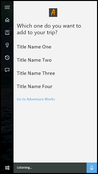 |
| Title with text | 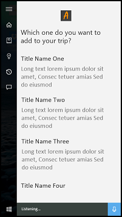 |
| Title with 68x68 icon | no image |
| Title with 68x68 icon and text | 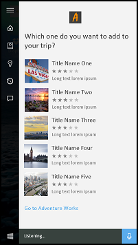 |
| Title with 68x92 icon | no image |
| Title with 68x92 icon and text | 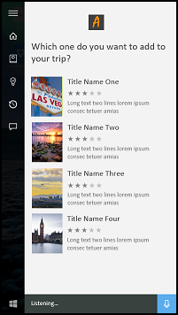 |
| Title with 280x140 icon | no image |
| Title with 280x140 icon and text | 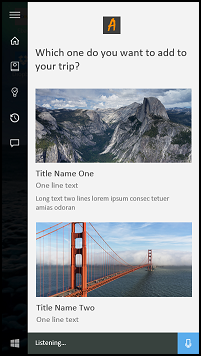 |

See [VoiceCommandContentTileType](https://msdn.microsoft.com/library/windows/apps/windows.applicationmodel.voicecommands.voicecommandcontenttiletype.aspx) for more info on Cortana templates.

## Example

This example demonstrates an end-to-end task flow for a background app in Cortana. We're using the **Adventure Works** app to cancel a trip to Las Vegas. This example uses the "Title with 68x68 icon and text" template.

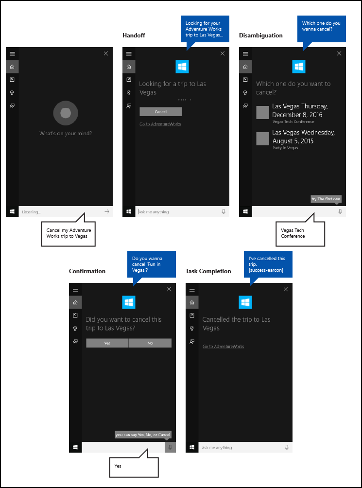

Here are the steps outlined in this image:

1. The user taps the microphone to initiate Cortana.
1. The user says "Cancel my Adventure Works trip to Vegas" to launch the **Adventure Works** app in the background. The app uses both Cortana speech and canvas to interact with the user.
1. Cortana transitions to a handoff screen that gives the user acknowledgment feedback ("I'll get Adventure Works on that."), a status bar, and a cancel button.
1. In this case, the user has multiple trips that match the query, so the app provides a disambiguation screen that lists all the matching results and asks, “Which one do you wanna cancel?”
1. The user specifies the "Vegas Tech Conference" item.
1. As the cancellation cannot be undone, the app provides a confirmation screen that asks the user to confirm their intent.
1. The user says "Yes".
1. The app then provides a completion screen that shows the result of the operation.

We explore these steps in more detail here.

### Handoff

| 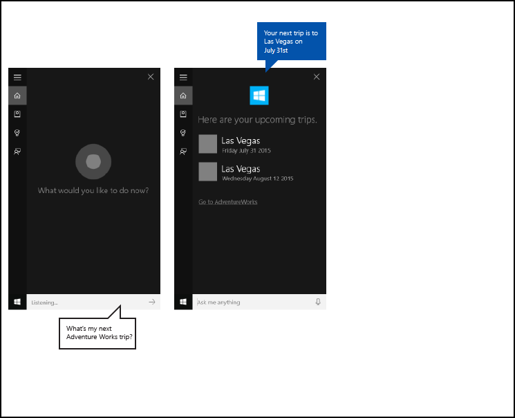 |
|--- |
| Find trip no handoff screen |

|  |
|--- |
| Cancel trip with handoff screen | 

Tasks that take less than 500ms for your app to respond, and require no additional information from the user, can be completed without further participation from Cortana, other than displaying the completion screen.

If your application requires more than 500ms to respond, Cortana provides a handoff screen. The app icon and name are displayed, and you must provide both GUI and TTS handoff strings to indicate that the voice command was correctly understood. The handoff screen will be shown for up to 5 seconds; if your app doesn't respond within this time, Cortana presents a generic error screen.

### GUI and TTS guidelines for handoff screens

Clearly indicate that the task is in progress.

Use present tense.

Use an action verb that confirms what task is initiating and reference the specific entity.

Use a generic verb that doesn't commit to the requested, incomplete action. For example, "Looking for your trip" instead of "Canceling your trip". In this case, if no results are returned the user doesn't hear something like "Cancelling your trip to Las Vegas… I couldn’t find a trip to Las Vegas".

Be clear that the task hasn’t already taken place if the app still needs to resolve the entity requested. For example, notice how we say “Looking for your trip” instead of “Cancelling your trip” because zero or more trips can be matched, and we don’t know the result yet.

The GUI and TTS strings can be the same, but don’t need to be. Try to keep the GUI string short to avoid truncation and duplication of other visual assets.

| TTS | GUI |
| --- | --- |
| Looking for your next Adventure Works trip. | Looking for your next trip… |
| Searching for your Adventure Works trip to Falls City. | Searching for trip to Falls City... |

### Progress

| 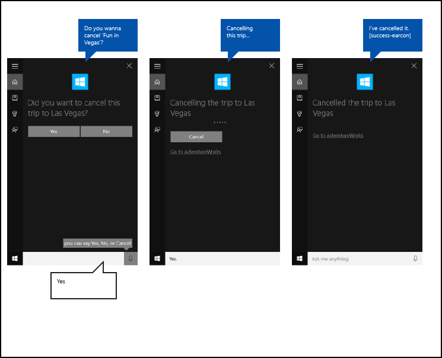 |
| --- |
| Cancel trip with progress screen |  

When a task takes a while between steps, your app needs to step in and update the user on what’s happening on a progress screen. The app icon is displayed, and you must provide both GUI and TTS progress strings to indicate that the task is underway.

You should provide a link to your app with launch parameters to start the app in the appropriate state. This lets the user view or complete the task themselves. Cortana provides the link text (such as, "Go to Adventure Works").

Progress screens will show for 5 seconds each, after which they must be followed by another screen or the task will time out.

These screens can follow a progress screen:

- Progress
- Confirmation (explicit, described later)
- Disambiguation
- Completion

### GUI and TTS guidelines for progress screens

Use present tense.

Use an action verb that confirms the task is underway.

**GUI**: If the entity is shown, use a reference to it ("Cancelling this trip…"); if no entity is shown, explicitly call out the entity ("Cancelling 'Vegas Tech Conference'").

**TTS**: You should only include a TTS string on the first progress screen. If further progress screens are required, send an empty string as your TTS string, and provide a GUI string only.

| Conditions  | TTS | GUI |
| --- | --- | --- |
| ENTITY READ ON PRIOR TURN / ENTITY SHOWN ON DISPLAY     | Cancelling this trip…          | Cancelling this trip…          |
| ENTITY NOT READ ON PRIOR TURN / ENTITY SHOWN ON DISPLAY | Cancelling your trip to Vegas… | Cancelling this trip…          |
| ENTITY NOT READ ON PRIOR TURN / ENTITY NOT SHOWN        | Cancelling your trip to Vegas… | Cancelling your trip to Vegas… |

### Confirmation

|  |
| --- |
| Cancel trip with confirmation screen | 

Some tasks can be implicitly confirmed by the nature of the user’s command; others are potentially more sensitive and require explicit confirmation. Here are some guidelines for when to use explicit vs. implicit confirmation.

Both GUI and TTS strings on the confirmation screen are specified by your app, and the app icon, if provided, is shown instead of the Cortana avatar.

After the customer responds to the confirmation, your application must provide the next screen within 500 ms to avoid going to a progress screen.

Use explicit when...

- Content is leaving the user (such as a text message, email, or social post)
- An action can’t be undone (such as making a purchase or deleting something)
- The result could be embarrassing (such as calling the wrong person)
- More complex recognition is required (such as open-ended transcription)

Use implicit when...

- Content is saved for the user only (such as a note-to-self)
- There’s an easy way to back out (such as turning an alarm on or off)
- The task needs to be quick (such as quickly capturing an idea before forgetting)
- Accuracy is high (such as a simple menu)

### GUI and TTS guidelines for confirmation screens

Use present tense.

Ask the user unambiguous questions that can be answered with "Yes" or "No". The question should explicitly confirm what the user is trying to do, and there should be no other obvious options.

Provide a variation of the question for a re-prompt, in case the voice command is not understood the first time.

**TTS**: For clarity, always reference the specific item or entity, unless it was read out by the system on the previous turn.

**GUI**: If the entity is shown, use a reference to it. If no entity is shown, explicitly call out the entity.

| Conditions | TTS | GUI |
| --- | --- | --- |
| ENTITY NOT READ ON PRIOR TURN / ENTITY SHOWN ON DISPLAY | Do you wanna cancel Vegas Tech Conference? | Cancel this trip?                             |
| ENTITY NOT READ ON PRIOR TURN / ENTITY NOT SHOWN        | Do you wanna cancel Vegas Tech Conference? | Cancel Vegas Tech Conference?                 |
| ENTITY READ ON PRIOR TURN / ENTITY NOT SHOWN            | Do you wanna cancel this trip?             | Cancel this trip?                             |
| REPROMPT WITH ENTITY SHOWN                              | Did you wanna cancel this trip?            | Did you want to cancel this trip?             |
| REPROMPT WITH ENTITY NOT SHOWN                          | Did you wanna cancel this trip?            | Did you want to cancel Vegas Tech Conference? |

### Disambiguation

| 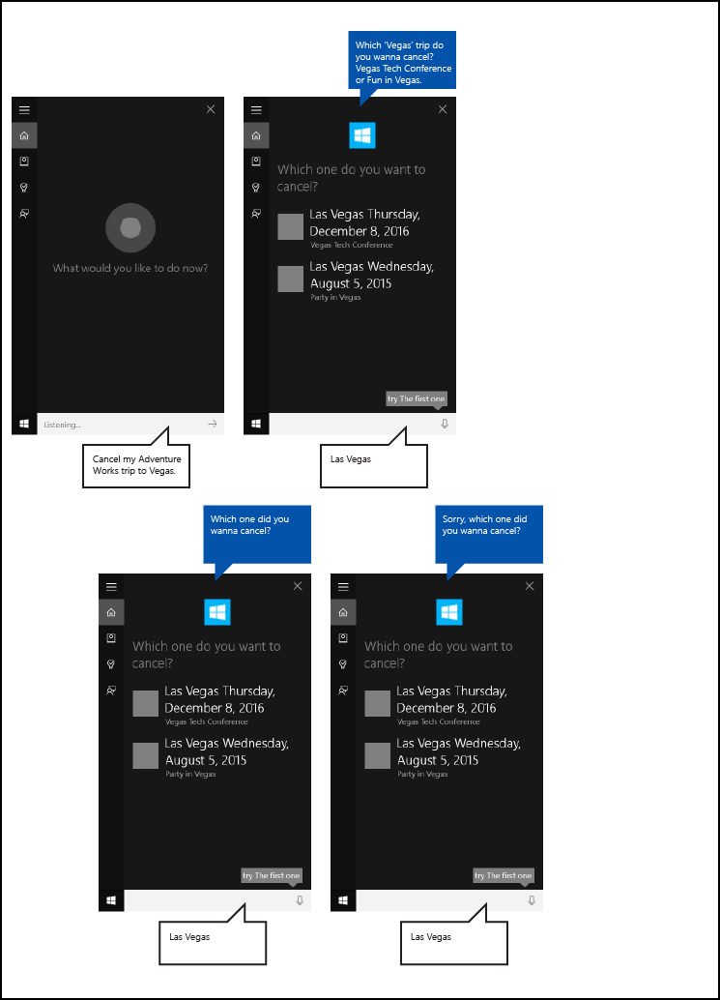 |
| --- |
| Cancel trip with disambiguation screen |

Some tasks might require the user to select from a list of entities to complete the task.

Both GUI and TTS strings on the disambiguation screen are specified by your app, and the app icon, if provided, is shown instead of the Cortana avatar.

After the customer responds to the disambiguation question, your application must provide the next screen within 500 ms to avoid going to a progress screen.

### GUI and TTS guidelines for disambiguation screens

Use present tense.

Ask the user unambiguous questions that can be answered with the title or text line of any entity displayed.

Up to 10 entities can be displayed. <--??

Each entity should have a unique title.

Provide a variation of the question for a re-prompt, in case the voice command is not understood the first time.

**TTS**: For clarity, always reference the specific item or entity, unless it was spoken on the previous turn.

**TTS**: Don't read out the entity list, unless there are three or fewer and they are short.

| Conditions | TTS | GUI |
|------------|-----|-----|
| PROMPT - 3 OR FEWER ITEMS  | Which Vegas trip do you wanna cancel? Vegas Tech Conference or Party in Vegas? | Which one do you want to cancel? |
| PROMPT - MORE THAN 3 ITEMS | Which Vegas trip do you wanna cancel?                                          | Which one do you want to cancel? |
| REPROMPT                   | Which Vegas trip did you wanna cancel?                                         | Which one do you want to cancel? |

### Completion

| 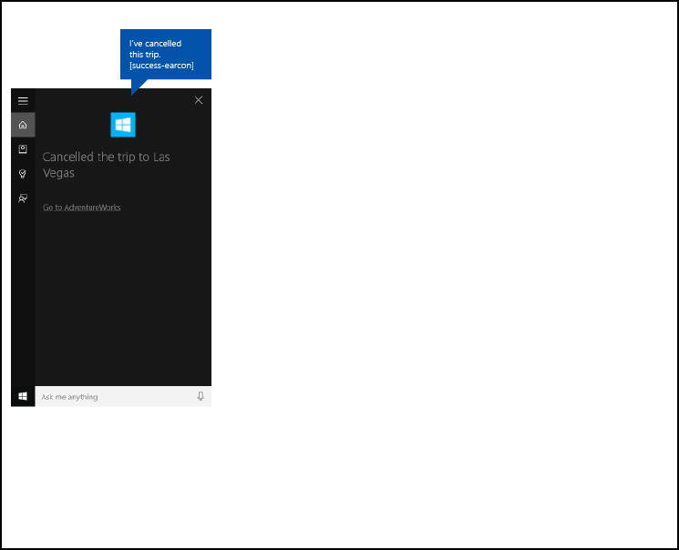 |
| --- |
| Cancel trip with completion screen |

On successful task completion, your app should inform the user that the requested task was completed successfully.

Both GUI and TTS strings on the completion screen are specified by your app, and the app icon (if provided), is shown instead of the Cortana avatar.

You should provide a link to your app with launch parameters to start the app in the appropriate state. This lets the user view or complete the task themselves. Cortana provides the link text (such as, "Go to Adventure Works").

### GUI and TTS guidelines for completion screens

Use past tense.

Use an action verb to explicitly state that the task has completed.

If the entity is shown, or it has been referenced on prior turn, only reference it.

| Conditions                                       | TTS                                             | GUI                                |
|--------------------------------------------------|-------------------------------------------------|------------------------------------|
| ENTITY SHOWN / ENTITY READ ON PRIOR TURN         | I’ve cancelled this trip.                       | Cancelled this trip.               |
| ENTITY NOT SHOWN / ENTITY NOT READ ON PRIOR TURN | I’ve cancelled your Vegas Tech Conference trip. | Cancelled "Vegas Tech Conference." |

### Error

| 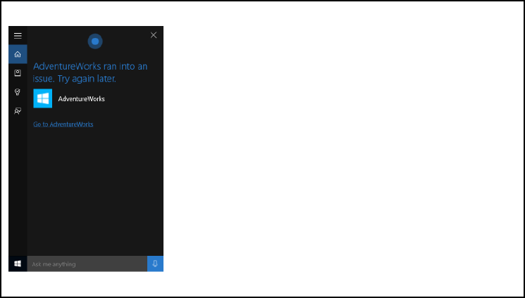 |
| --- |
| Cancel trip with error screen |

When one of the following errors occur, Cortana displays the same generic error message.

- The app service terminates unexpectedly.
- Cortana fails to communicate with the app service.
- The app fails to provide a screen after Cortana shows a handoff screen or a progress screen for 5 seconds.

## Related articles

<!-- - [Principles of Cortana skills design](design-principles.md) commented out for archiving
- [Cortana skills](../../skills/get-started.md) -->
