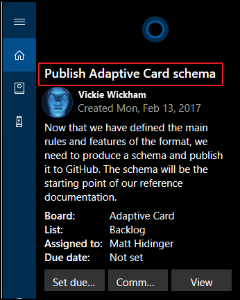
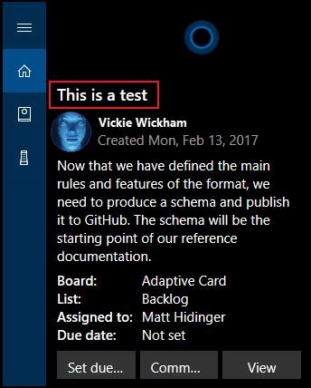
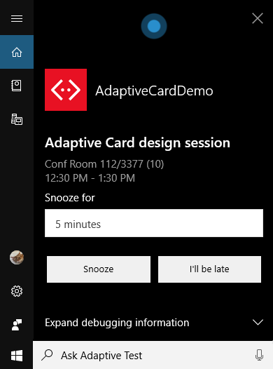

# Use AdaptiveCards in Your Cortana Skill

Cards are interface elements that you can use to enhance the user experience in your Cortana skill. As with all cards, you can only use them when Cortana is running on a device with a display. See [Determine Cortana's device type](./cortana-device-type.md) to get device information.
  
An adaptive card is the most versatile display card. It's customizable, and can include any combination of text, speech, images, buttons, and input fields.  

## AdaptiveCards  

Adaptive cards provide the following options.  

|     |     |
| --- | --- |
|**Input controls** | Add input controls for text, date, number, time, toggle switch, and choice set.  |
|**Richer text** | Text in your card is not limited to title, subtitle, and text fixed formats. Use a variety of font sizes, formats, and colors. |
|**A single open card exchange format** | Use your existing cards in a common and consistent way and extend your cards with rich controls using a common schema.  |

AdaptiveCards use the open card exchange format. This format enables you to specify user interface content for all cards in your skill in a common and consistent way. You describe the content as a simple JSON object. The JSON content is natively displayed by the skill and automatically adapts to the look and feel of your skill.  _Note, Cortana currently support Adaptive Cards version 1.0._

AdaptiveCards include elements, containers, actions, and inputs. A basic adaptive card includes:

* an adaptive card root object,
* an adaptive card body, which includes the elements of your card, and
* actions for your adaptive card, which are typically displayed in an action bar at the bottom of your card.  

## AdaptiveCards Designer

The AdaptiveCards Designer provides an interactive card builder where you can see the resulting card JSON data.

* [adaptivecards.io/designer](https://adaptivecards.io/designer)

<!--
 The sample text block provides the title text for the sample card in the AdaptiveCards Visualizer.

 ```json
 "type": "TextBlock",
 "text": "Publish adaptive card schema",
 "weight": "bolder",
 "size": "medium"
 ```

   

 You can change the title text by updating the text block.

 ```json
 "type": "TextBlock",
 "text": "This is a test",
 "weight": "bolder",
 "size": "medium"
 ```  

   
 -->
 
## Create an AdaptiveCard
You can create adaptive cards using `proxy pattern` helper classes in the [SDK](https://docs.microsoft.com/adaptive-cards/), or by directly using JSON following the [schema](https://docs.microsoft.com/adaptive-cards/authoring-cards/card-schema).

>[!IMPORTANT]
> 1. The speak object of an adaptive card needs to be copied to the Message for Cortana to speak the text.
> 1. The speak object text needs to be wrapped in SSML `<speak>` tags (if it is not already).

### Create using .NET

1. Install the `AdaptiveCards` NuGet package.
1. Specify the elements of your card in code.
1. Add the card to your Cortana skill as an attachment.

The following code adds an adaptive card to a Cortana skill response for Bot Framework V3.

 ```csharp
 var response = context.MakeMessage();

 AdaptiveCard card = new AdaptiveCard();

 card.Body.Add(new AdaptiveTextBlock()
     {
         Text = "This is a test",
         Weight = TextWeight.Bolder
         Size = TextSize.Medium,
     }
 );

 response.Attachments.Add(card.ToAttachment());

 await context.PostAsync(response);
 context.Wait(MessageReceived);
 ```  
 
### Create using JavaScript

1. Install the `adaptivecards` [NPM package](https://docs.microsoft.com/en-us/adaptive-cards/sdk/rendering-cards/javascript/getting-started) (optional)
1. Use JSON to build your card in code, or the proxy object from the `adaptivecards` package
1. Add the card to your skill as an attachment.

 ```javascript
let msg = new builder.Message(session)
// In JavaScript, JSON is integrated
msg.addAttachment({
		"contentType": "application/vnd.microsoft.card.adaptive",
		"content": {
			"$schema": "http://adaptivecards.io/schemas/adaptive-card.json",
			"type": "AdaptiveCard",
			"version": "1.0",
			"body": [{
				"type": "TextBlock",
				"text": "This is a test",
				"size": "medium",
				"weight": "bolder"
			}]
		}
	});
session.send(msg);
 ```

## Respond to AdaptiveCards
Take the [Calendar reminder](https://adaptivecards.io/samples/CalendarReminder.html) example on the AdaptiveCards website. 
Note it has two `Action.Submit` buttons for _Snooze_ or _Late_ response.  For _Snooze_, there is a `Input.ChoiceSet` with
standard values of 5, 10, and 15 minutes.

Cortana will speak, _"Your  meeting about 'Adaptive Card design session' is starting at 12:30pm. Do you want to Snooze or do you want to send a late notification to the attendees?"_ and display:

   

Cortana skills should be designed for voice first, so consider this code that supports spoken replies like
- I'll be **Late**
- **Snooze** for 10 minutes
based on simple keyword search.

You will receive a JSON `value` attached to the response message with the `data` properties of the `Action.Submit` buttons, along with
any `Input` fields with their `id` and `value` fields.  Given this example, if the user clicks the _Snooze_ button, they'll see
```
 "value": {
      "x": "snooze",  <-- the Action.Submit data
      "snooze": "5"   <-- the Input.ChoiceSet id and selected value
    }
```
_You should ignore the `text` property on the message if a `value` is present._

If the response is spoken, there will be a `text` response on the message, but no `value`.

You should handle both cases.


### Respond in C#
```C#
...
        // match 1 or 2 digits and white space and "minute"
        private static Regex regexMinutes = new Regex(@"(\d{1,2})\s+minute", RegexOptions.IgnoreCase);
...
                var message = await argument;
                var response = context.MakeMessage();
	    
                string sValue = "unknown";

                if (message.Value != null)
                {
                    // Got an Action Submit
                    dynamic value = message.Value;
                    string xValue = (string)value.SelectToken("x");
                    if (xValue.Equals("snooze"))
                    {
                        string snoozeValue = (string)value.SelectToken("snooze");
                        response.Text = "You clicked \"Snooze\" for " + snoozeValue + " minutes.";
                        response.Speak = response.Text;
                    }
                    else if (xValue.Equals("late"))
                    {
                        response.Text = "You clicked \"I'll be late.\"";
                        response.Speak = response.Text;
                    }
                    else
                    {
                        response.Text = "Unsupported input detected.";
                        response.Speak = response.Text;

                        sValue = value.ToString();
                        Trace.WriteLine(sValue);
                    }
                }
                else
                {
                    // Got a Voice/Text response - check for keywords
                    string sText = message.Text.ToUpper(); // as Contains doesn't allow case insensitive
                    if (sText.Contains("SNOOZE"))
                    {
                        Match m = regexMinutes.Match(sText);
                        if (m.Success)
                        {
                            Group g = m.Groups[1];
                            string snoozeValue = g.Value;
                            response.Text = "You said \"Snooze\" for " + snoozeValue + " minutes.";
                            response.Speak = response.Text;
                        }
                        else
                        {
                            response.Text = "You said \"Snooze\". I'll snooze for the default 5 minutes.";
                            response.Speak = response.Text;
                        }
                    }
                    else if (sText.Contains("LATE"))
                    {
                        response.Text = "You said \"I'll be late.\"";
                        response.Speak = response.Text;
                    }
                    else
                    {
                        response.Text = "I am not sure what you mean.";
                        response.Speak = response.Text;

                        Trace.WriteLine(sText);
                    }
                }

                await context.PostAsync(response);
                context.Wait(MessageReceivedAsync); // hand back to "say anything to show the card"        
```

### Respond in JavaScript
```JavaScript
        let message = session.message;
        var response = new builder.Message(session);

        session.conversationData.step = 1; // Reset to first step
        if (message.value) {
            // Got an Action Submit payload
            let xValue = message.value.x;
            if (xValue === 'snooze') {
                let snoozeValue = message.value.snooze;
                let msg = `You clicked "Snooze" for ${snoozeValue} minutes.`;
                response.text(msg);
                response.speak(msg);
            } else if (xValue === 'late') {
                const msg = 'You clicked "I\'ll be late."';
                response.text(msg);
                response.speak(msg);
            } else {
                const msg = 'Unsupported input detected.';
                response.text(msg);
                response.speak(msg);

                console.log(JSON.stringify(message.value));
            }
        } else {
            // Got a Voice/Text response - check for keywords
            let text = message.text.toUpperCase();
            if (text.includes('SNOOZE')) {
                // match 1 or 2 digits and white space and "minute"
                const regexMinutes = new RegExp('(\\d{1,2})\\s+minute', 'i');
                var match = regexMinutes.exec(text);
                if (match && match.constructor === Array && match.length == 2) {
                    let msg = `You said "Snooze" for ${match[1]} minutes.`;
                    response.text(msg);
                    response.speak(msg);
                } else {
                    const msg = 'You said "Snooze". I\'ll snooze for the default 5 minutes.';
                    response.text(msg);
                    response.speak(msg);
                }
            } else if (text.includes('LATE')) {
                const msg = 'You said "I\'ll be late."';
                response.text(msg);
                response.speak(msg);
            } else {
                const msg = 'I am not sure what you mean.';
                response.text(msg);
                response.speak(msg);

                console.log(text);
            }
        }
        session.send(response);
```

## More Information  

* For more information about adaptive cards, visit the  [adaptivecards.io](https://adaptivecards.io) page.  
* For more information about Bot Framework cards using .Net, visit the [Add rich card attachments to messages](https://docs.microsoft.com/azure/bot-service/dotnet/bot-builder-dotnet-add-rich-card-attachments?view=azure-bot-service-3.0) for .NET page.
* For more information about Bot Framework cards using Node.js, visit the [Add rich card attachments to messages](https://docs.microsoft.com/azure/bot-service/nodejs/bot-builder-nodejs-send-rich-cards?view=azure-bot-service-3.0) for Node.js page.
* For the example referenced on this page, please visit [cortana-skills-samples on GitHub](https://github.com/Microsoft/cortana-skills-samples)
