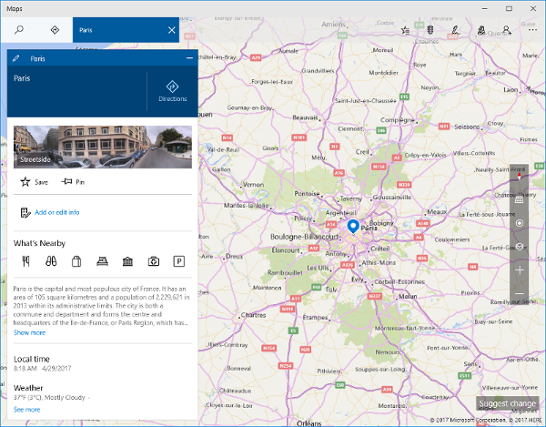
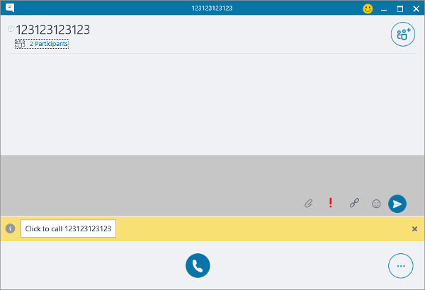

# Launching apps or websites from a Cortana skill

With Cortana, it's possible for your skill to launch an app or website. To do this, include the `channelData` property in the message that you send Cortana, and set the `channelData` property to the [Action object](#action-object) that defines the action you want Cortana to perform. For examples, see:

- [Launch a website](#launch-a-website)
- [Launching and deep linking an app](#launching-and-deep-linking-an-app)
- [Start a Skype call or IM](#start-a-skype-call-or-im)
- [Create an email](#create-an-email)

## Cortana channel data objects used to launch apps and websites

These are the objects that you use to specify the channel data that you send to Cortana.

### Action object

Defines a Cortana action.

| Property | Type | Description 
|-|-|-
| action | [CortanaAction](#cortanaaction-object) | The action to perform.

### CortanaAction object

Defines the action to perform.

| Property | Type | Description 
|----------|------|-------------|
| type | string | The type of action to perform. Use the value `LaunchUri`.
| uri | string | The URI of the app or website to launch.  

## Launch a website

This example shows how to specify the channel data used to launch the Bing website.

# [C#](#tab/cs1)

```csharp
var message = context.MakeMessage() as IMessageActivity;
reply.ChannelData = JObject.FromObject(new {
     action = new { type = "LaunchUri", uri = "https://bing.com"}
});
await context.PostAsync(message);
```

# [JavaScript](#tab/js1)

```JavaScript
var msg = new builder.Message(session)
     .sourceEvent(
       {
       cortana: {
        action: {
          type: "LaunchUri",
          uri: "https://bing.com"
          }
        }
    });
    session.endConversation(msg); 
```

---

## Launching and deep linking an app

To launch an app, use the app's protocol activation URL.

As an example, in Windows 10, the built-in Maps app supports launching and deep linking. (For information about the Maps app and different ways to launch it, see [Launch the Windows Map app](https://docs.microsoft.com/windows/uwp/launch-resume/launch-maps-app).) 
This code shows how to specify the channel data used to launch the Maps app, and center the map over Paris.

# [C#](#tab/cs2)

```csharp
var message = context.MakeMessage() as IMessageActivity;
message.ChannelData = JObject.FromObject(new {
     action = new { type = "LaunchUri", uri = "bingmaps:?where=Paris"}
});
await context.PostAsync(message);
```

# [JavaScript](#tab/js2)

```JavaScript
var msg = new builder.Message(session)
     .sourceEvent(
       {
       cortana: {
        action: {
          type: "LaunchUri",
          uri: "bingmaps:?where=Paris"
          }
        }
    });
    session.endConversation(msg); 
```

---

The following image shows the launched Map app.



For further reference, you can find documentation on UWP protocol handlers [here](https://docs.microsoft.com/windows/uwp/launch-resume/launch-maps-app).

## Start a Skype call or IM

If the user has Skype installed, they can launch it to to start a call or instant message conversation in [Skype for Business](https://technet.microsoft.com/library/gg398376(v=ocs.15).aspx) or the home version of [Skype](https://msdn.microsoft.com/library/office/dn745878.aspx) on Windows, Android, and iOS.

**Skype for Business**

If the user is signed into Skype for Business, the following code opens an instant message conversation window with "someone@example.com".

# [C#](#tab/cs3)

```csharp
var message = context.MakeMessage() as IMessageActivity;
message.ChannelData = JObject.FromObject(new
{
    action = new { type = "LaunchUri", uri = "sip:someone@example.com" }
});
await context.PostAsync(message);
```

# [JavaScript](#tab/js3)

```JavaScript
var msg = new builder.Message(session)
     .sourceEvent(
       {
       cortana: {
        action: {
          type: "LaunchUri",
          uri: "sip:someone@example.com"
          }
        }
    });
    session.endConversation(msg); 
```

---

If the user is signed into Skype for Business, the following code opens a window and readies a phone call to "123123123123".

# [C#](#tab/cs4)

```csharp
var message = context.MakeMessage() as IMessageActivity;
message.ChannelData = JObject.FromObject(new
{
    action = new { type = "LaunchUri", uri = "tel:123123123123" }
});
await context.PostAsync(message);
```

# [JavaScript](#tab/js4)

```JavaScript
var msg = new builder.Message(session)
     .sourceEvent(
       {
       cortana: {
        action: {
          type: "LaunchUri",
          uri: ""tel:123123123123"
          }
        }
    });
    session.endConversation(msg); 
```

---

The following image shows the launched Skype for Business window.



>[!NOTE]
>At the time of writing, there is limited support for both the [SIP](https://www.ietf.org/rfc/rfc3261.txt) and [tel](https://www.ietf.org/rfc/rfc3966.txt) protocols in Skype for Business.

**Skype**

If the user is signed in to the standard version of Skype, then the following code will start a call with Skype user "echo123".
The URI API reference is [here](https://docs.microsoft.com/skype-sdk/skypeuris/skypeuriapireference).

# [C#](#tab/cs5)

```csharp
var message = context.MakeMessage() as IMessageActivity;
message.ChannelData = JObject.FromObject(new
{
    action = new { type = "LaunchUri", uri = "skype:echo123?call" }
});
await context.PostAsync(message);
```

# [JavaScript](#tab/js5)

```JavaScript
var msg = new builder.Message(session)
     .sourceEvent(
       {
       cortana: {
        action: {
          type: "LaunchUri",
          uri: "skype:echo123?call"
          }
        }
    });
    session.endConversation(msg); 
```

---

## Create an email

This example shows how to create an email message in the user's email client, ready for them to send. The example creates an email addressed to "someone@example.com", with a subject line of "This is the subject", and a body of "This is the body".

# [C#](#tab/cs6)

```csharp
var message = context.MakeMessage() as IMessageActivity;
message.ChannelData = JObject.FromObject(new
{
    action = new { type = "LaunchUri", uri = "mailto:someone@example.com?subject=This%20is%20the%20subject&body=This%20is%20the%20body" }
});
await context.PostAsync(message);
```

The following image shows the crafted email.


## Cortana channel data objects used to launch apps and websites

The following are the objects that you use to specify the channel data that you send Cortana.

### Action object

Defines a Cortana action.

| Property | Type | Description 
|-|-|-
| action | [CortanaAction](#cortanaaction-object) | The action to perform. 
# [JavaScript](#tab/js6)

```JavaScript
var msg = new builder.Message(session)
     .sourceEvent(
       {
       cortana: {
        action: {
          type: "LaunchUri",
          uri: "mailto:someone@example.com?subject=This%20is%20the%20subject&body=This%20is%20the%20body"
          }
        }
    });
    session.endConversation(msg); 
```

---

Here's the email message as displayed as displayed to the user, ready to send.

| Property | Type | Description
|----------|------|-------------|
| type | string | The type of action to perform. The possible values are:<ul><li>LaunchUri</li></ul>
| uri | string | The URI of the app or website to launch.

