# Create your first Cortana skill

Once you have set up your environment, you can dive in and build your first Cortana skill. As you learned in the previous module, you can develop a Cortana skill on either a Mac or a PC running Windows 10 Anniversary Update (build 1607) or later, using your choice of development tools. For more information on setting up your development environment, see [Set up your development environment](./mva21-setup.md).

This module shows the basics of creating a Cortana skill using the Azure Portal and Azure Bot Service. First, you'll create a bot, and then register it and connect it to the Cortana channel to make it a Cortana skill.

For more information on creating your first skill, see [Create your first skill](./get-started.md).

## Step 1 - Create a bot using the Azure Bot Service

To create a bot using the Azure Bot Service, first open the [Microsoft Azure Portal](https://ms.portal.azure.com) and log in with your Microsoft account.

1. Click on `Create a resource`.

1. In the `Azure Marketplace` pane, click `AI + Machine Learning`.

1. Click on `Web App Bot` in the `Featured` column.

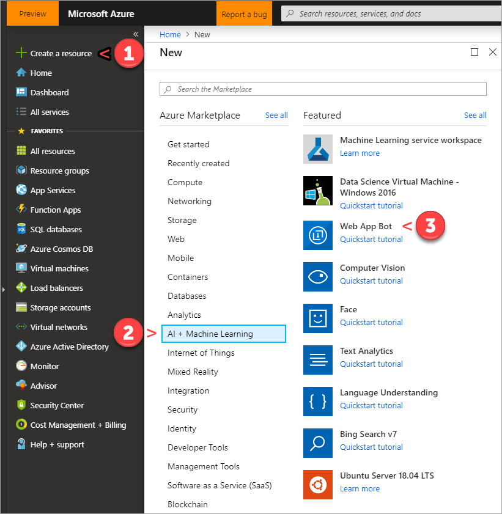

Enter a name for your bot. The bot service uses the bot name as the default name for the resource group name and app name.

Specify your subscription plan, location, app name, and the bot template you want to use, and then click `Create`. To create a simple guided conversation bot that pretends to book a trip for you, use the `Basic` template.

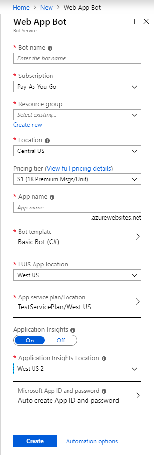

It may take a while to provision and initialize your bot. When the process is complete, you'll be taken to a screen that lists your resource. From here, you can test your bot. If it's not listed under `Recent resources`, click on `See all your resources`.

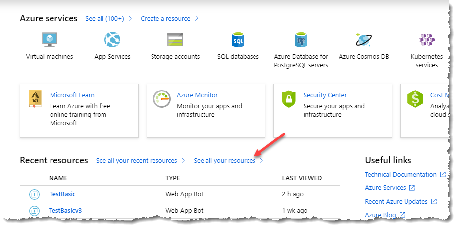

In the `All resources` pane, you should see your skill name listed. There will probably be more than one entry on the list. Click on the one whose type is `Web App Bot`.

This will bring up a summary screen showing the options for your bot. The screenshot below highlights the two testing options, `Test in Web Chat` and `Test your bot online in Web Chat`. You can click on either one. They both take you to the same test screen.

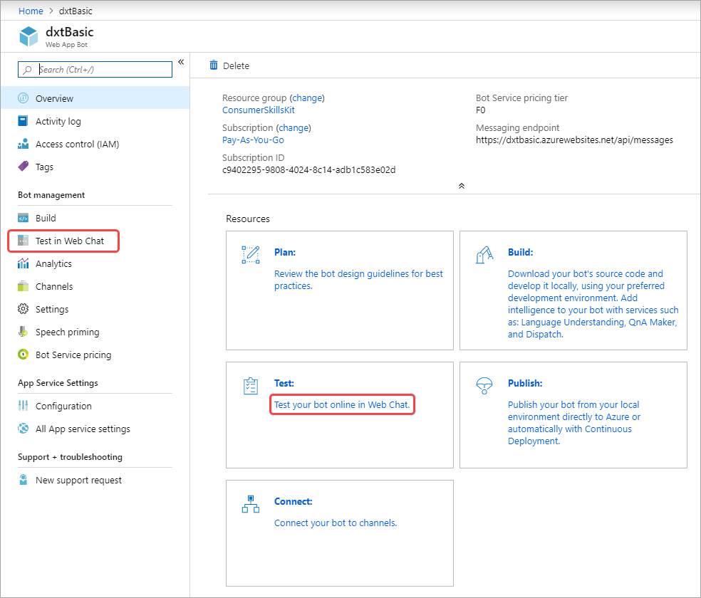

In the test screen, try typing something over the `Type your message...` prompt at the bottom of the screen. It doesn't matter what you enter, you'll see the screen shown below.

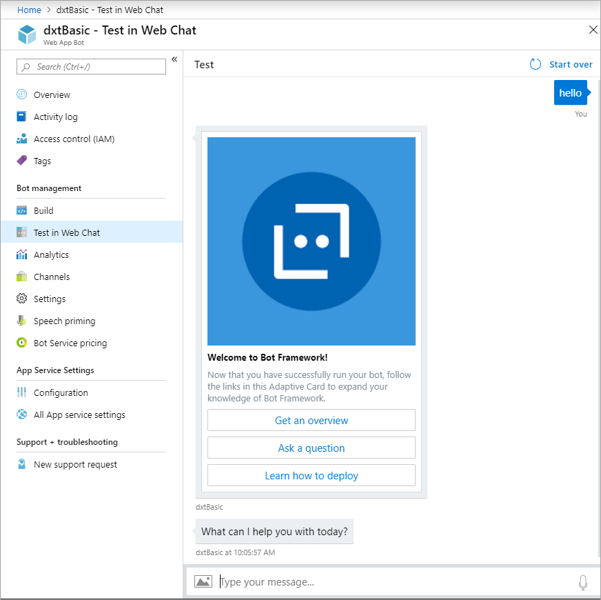

Again, when you see the `What can I help you with today?` query, it doesn't matter what your response is. The test will always ask `Where would you like to travel to?`. This is the start of a guided conversation about booking a trip. The bot isn't actually doing anything on the backend. You can book any trip you like, as this sample shows.

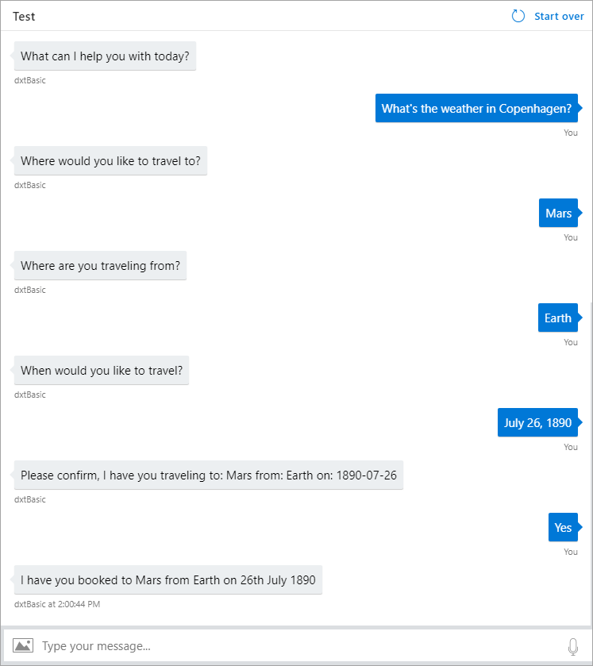

## Step 2 - Explore the code

The dxtBasic bot uses .NET C# code that is part of the Basic bot template. To view the code behind the bot:

1. Click `Build` under `Bot management`.

1. For purposes of this example, click on the `Open online code editor` link to open the `App Service Editor`.

1. If you'd prefer to work in a local editor, you can click on `Download Bot source code` in the `Build` section, but this example won't cover that.

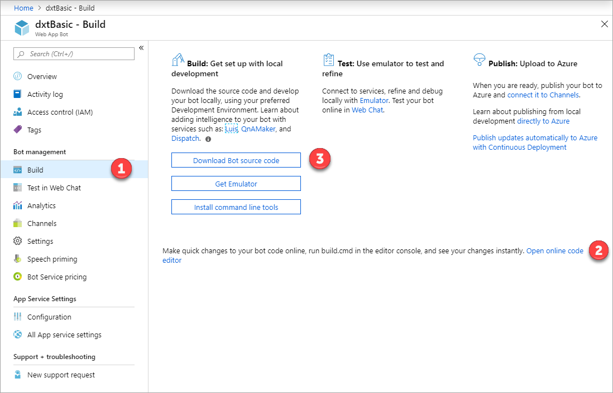

When the online editor opens, it will display the readme file (readme.md).

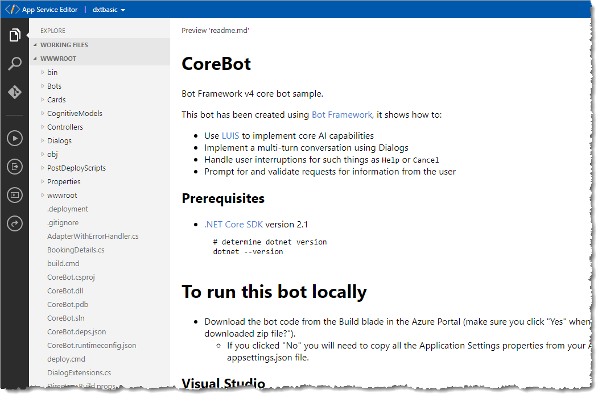

As you can see by looking at the sidebar, there's C# code in the `Bots`, `Controllers`, and `Dialogs` sections. For this example, the bot's confirmation output line has been changed in `MainDialog.cs` (highlighted below). For the changes to take effect, you need to redeploy the bot. Click the `Open Console` icon to open the console window.

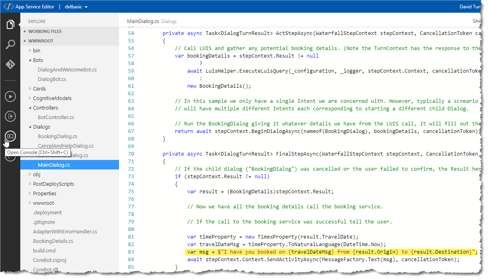

After the console opens, enter `build.cmd`.

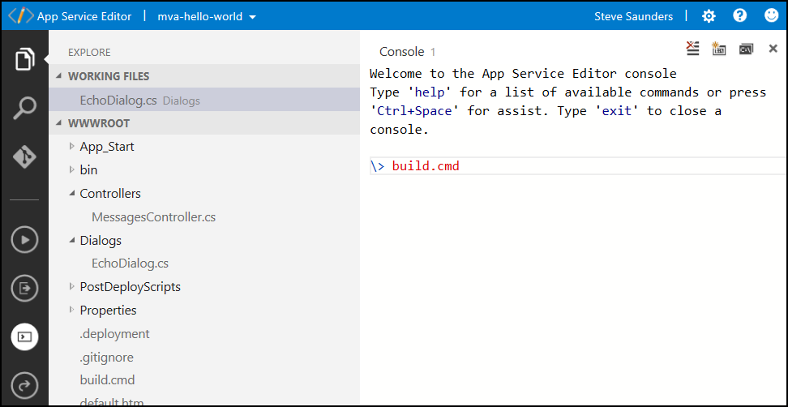

You'll see a lot of status lines printed to the console. Once the process is complete, you can return to the `Test` pane to test your bot. In this case, after going through the guided conversation again, you'll see a different confirmation line.

## Step 3 - Connect your Azure Bot to the Cortana Channel

Once you have created a bot, connect it to the Cortana channel to make it a Cortana skill.

On the bot's Overview page, click on the `Connect your bot to channels.` link.

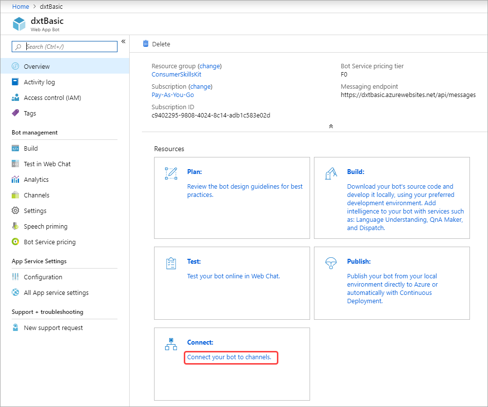

On the Configure Cortana page, scroll down to the `Discovery and Management` section and click `Manage`. Click the `Publish` menu tab and then `Publish to self` to open the channel configuration settings, where you can specify an optional icon for the skill, a display name, and the invocation name. Cortana uses the invocation name you specify to invoke the skill.

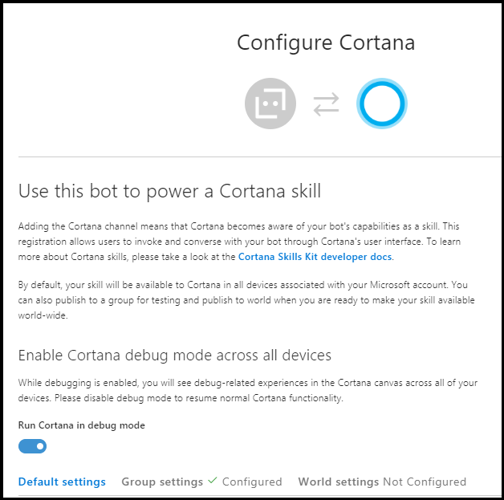  

On the Channels tab of the Azure Portal, you can now see Cortana listed as an `mva-hello-world` bot service channel.

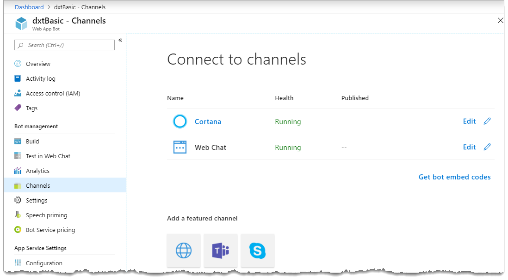

To return to the `Configure Cortana` page, where you can update the skill's configuration settings, click `Edit`. To test your new skill, direct Cortana to invoke the skill using the invocation name you specified. For example, "Cortana, tell Hello World 'hi there'."