# Building conversations

In [Create your first Cortana skill](./mva22-hello-world.md) you learned how to create a Cortana skill that uses a basic single-turn conversation. You type something and Cortana repeats it, telling you how many characters you typed.

For many Cortana skills, a single-turn conversation is all you need. However, natural language understanding technology such as [LUIS](https://www.luis.ai/about) (Language Understanding Intelligent Service) makes it possible to create Cortana skills that support multi-turn conversations. Users can then interact with Cortana in a variety of ways.

Creating a Cortana skill that uses LUIS is similar to creating a basic Cortana skill, but requires some additional steps.

## Step 1 - Create a LUIS bot

When you create a LUIS bot, Microsoft Azure automatically creates a corresponding LUIS application where you can specify language understanding criteria. Before creating the bot, open the [LUIS.ai](https://www.luis.ai) site to create a LUIS account.

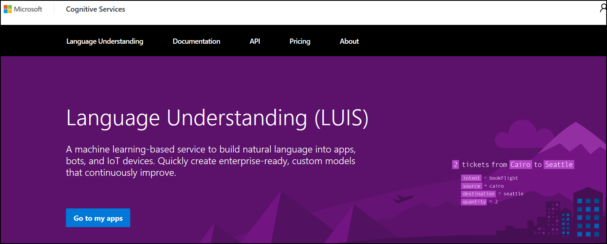

You can then follow the initial steps in [Create your first Cortana skill](./mva22-hello-world.md) to create the bot:

* Log in to the [Microsoft Azure Portal](https://ms.portal.azure.com) with your Microsoft account.
* Click `New` to open the **Azure Marketplace** pane.
* In the **Azure Marketplace** pane, click `AI + Cognitive Services`, and then `Web App Bot`.
* In the **Bot Service** pane, enter a name for your bot, the location and app service plan, and the bot template you want to use. To create a LUIS bot, select the **Language understanding** template. Then click `Create`.

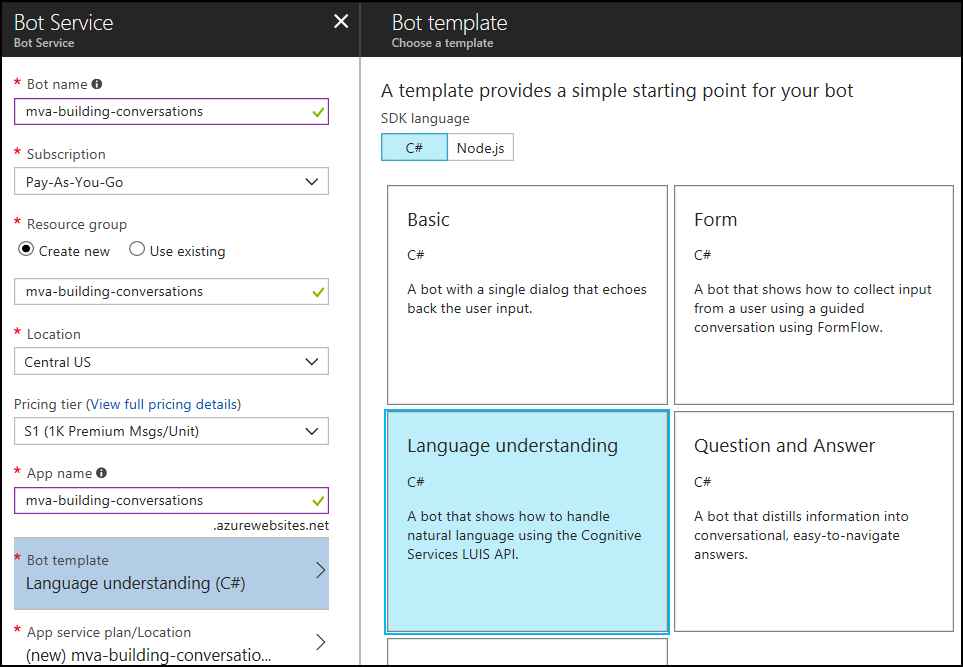

The language understanding service automatically creates a LUIS application for your bot. Log in to your LUIS account or refresh the MyApps page on [LUIS.ai](https://www.luis.ai) to see the LUIS application.

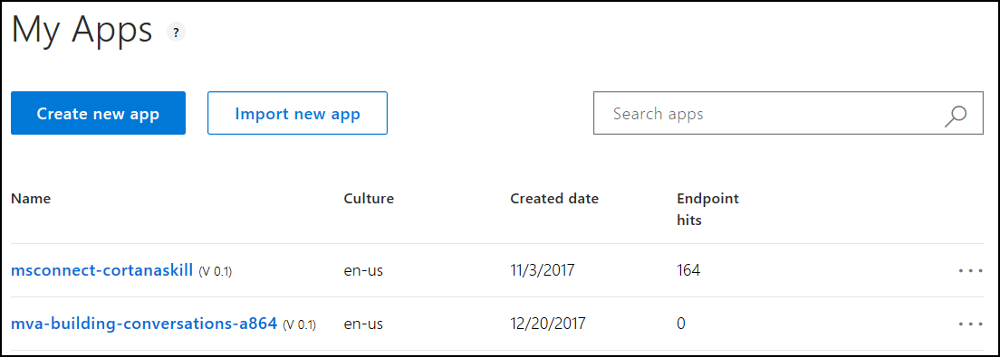

For more information about creating a LUIS bot, see [Create a bot using the Language understanding template](https://docs.microsoft.com/azure/bot-service/bot-service-concept-templates?view=azure-bot-service-3.0#language-understanding-bot).

## Step 2 - Add intents to your LUIS application

 Using LUIS technology in your Cortana skill helps Cortana interpret the meaning of a user's input. You can define a set of *entities* that you want Cortana to recognize to take the appropriate action, and *intents* to represent an action that you want Cortana to take. For now, we'll define some intents for a Cortana skill that helps find, assemble, and save a mixtape of songs.

 To add an intent to your LUIS application, click the application name on the MyApps page on [LUIS.ai](https://www.luis.ai) to open the application's dashboard, and then click `Intents` to open the **Intents** page.

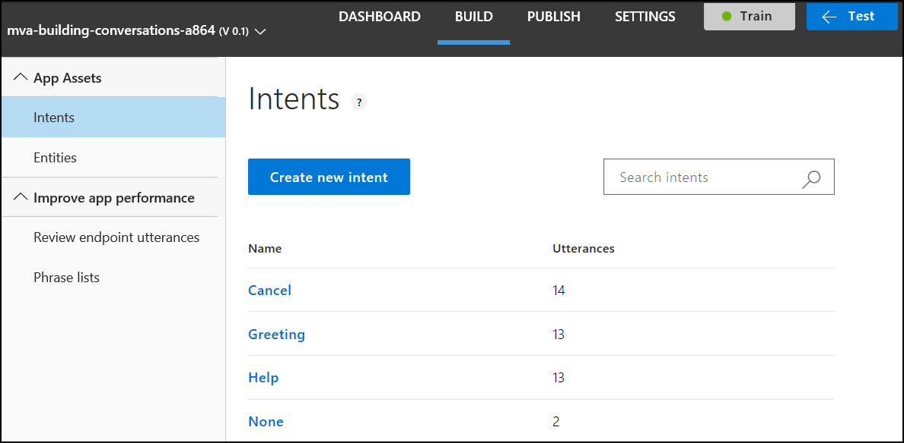

Click `Create new intent` to open the **Create new intent** dialog box, and then specify a name for the intent.

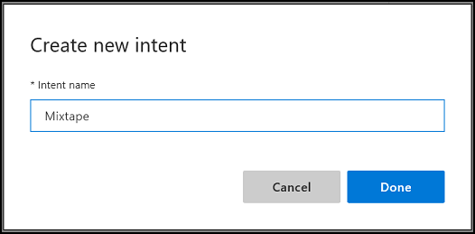

Optionally, you can specify *utterances* associated with the intent. An utterance is a possible input from a user that is associated with the intent. LUIS starts with the utterances you specify. When your Cortana skill is published and users enter their own utterances, LUIS uses *active learning* to help Cortana better understand how to respond.

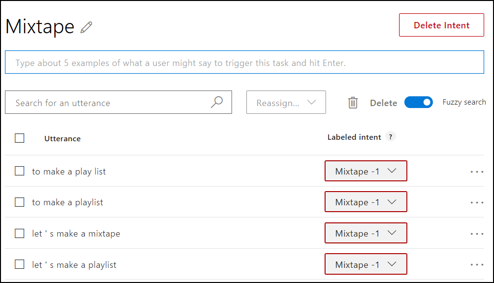

You can add additional intents and utterances to your LUIS application.

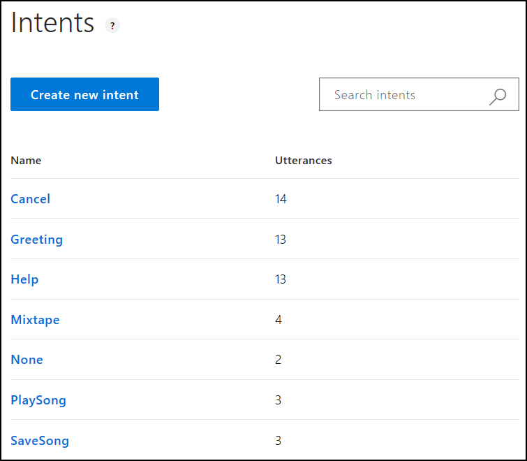

After you have created intents in your LUIS application, you can add code to your LUIS bot that specifies how Cortana responds to an intent.

## Step 3 - Add code to your LUIS bot

To add code to your LUIS bot, return to the Azure portal, open the bot's management pane, and click `Build` to open the **Choose how to work with your code** pane.

You can add code to the bot using the online code editor on the Azure portal, or you can download the source code and edit it in your choice of development environment. To download the source code, click `Download zip file` under **Download source code**.

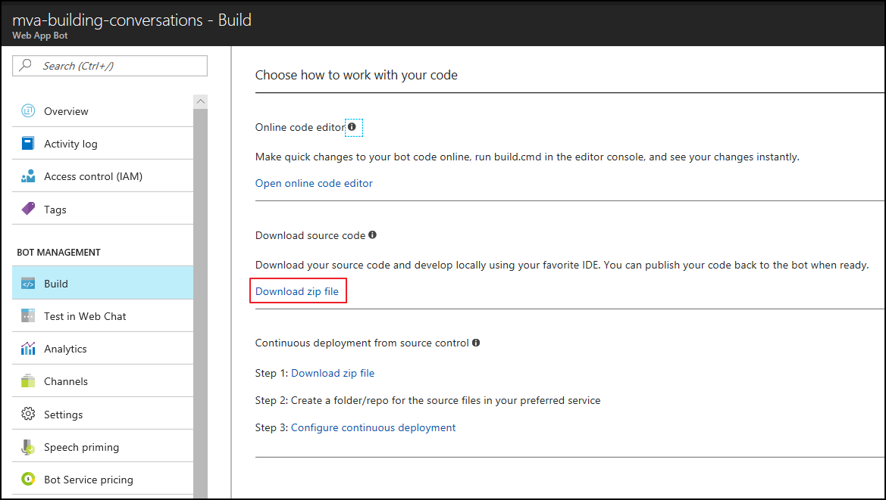

Save the zip file to your machine and extract the project files. To edit the code in Visual Studio, open the Visual Studio Solution file in the project's root directory.

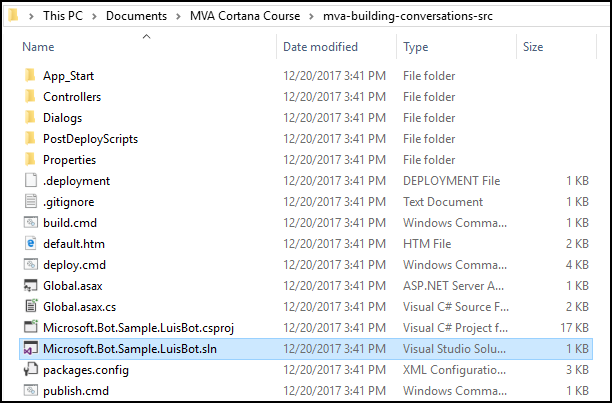

Then open the BasicLuisDialog module.

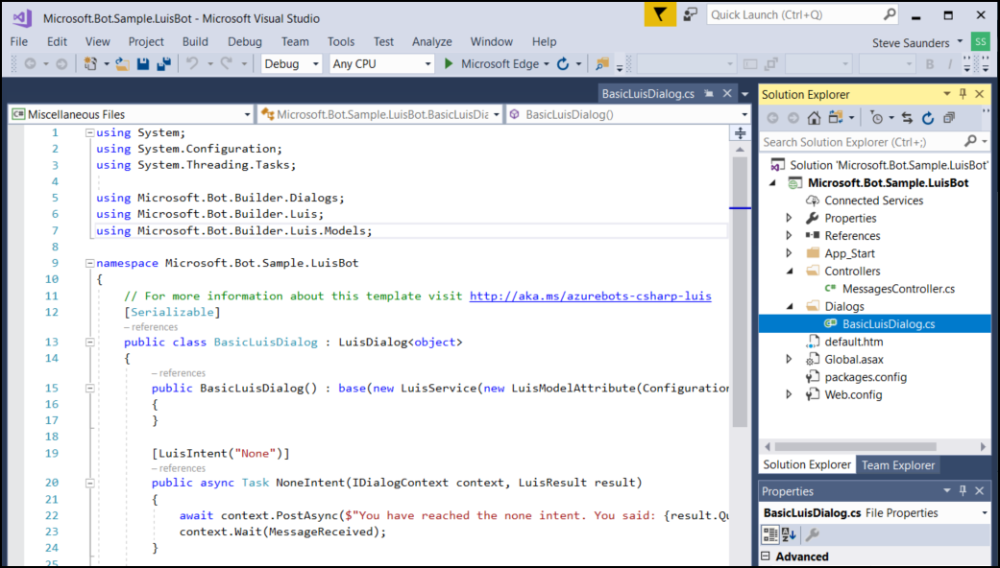

Add a reference to the **Microsoft.Bot.Connector** namespace to allow your LUIS bot to send and receive messages to the Cortana channel.

``` C#
    using Microsoft.Bot.Connector;
```

Then replace the **LuisIntent** blocks in the **Microsoft.Bot.Sample.LuisBot** namespace with the following code:

``` C#
    [LuisIntent("None")]
    public async Task NoneIntent(IDialogContext context, LuisResult result)
    {
        var response = context.MakeMessage();
        response.Text = "Welcome to Mixtape! How can I help?";

        response.InputHint = InputHints.ExpectingInput;
        await context.PostAsync(response);
        context.Wait(MessageReceived);
    }

    [LuisIntent("Mixtape")]
    public async Task MixtapeIntent(IDialogContext context, LuisResult result)
    {
        var response = context.MakeMessage();
        response.Text = "Welcome to Mixtape! Let's find a song to play.";

        response.InputHint = InputHints.ExpectingInput;
        await context.PostAsync(response);
        context.Wait(MessageReceived);
    }

    [LuisIntent("PlaySong")]
    public async Task PlaySongIntent(IDialogContext context, LuisResult result)
    {
        var response = context.MakeMessage();
        response.Text = "Here's a song for you.";

        response.InputHint = InputHints.ExpectingInput;
        await context.PostAsync(response);
        context.Wait(MessageReceived);
    }

    [LuisIntent("SaveSong")]
    public async Task SaveSongIntent(IDialogContext context, LuisResult result)
    {
        var response = context.MakeMessage();
        response.Text = "Sign in to save the song to a mixtape.";

        response.InputHint = InputHints.AcceptingInput;
        await context.PostAsync(response);
        context.Wait(MessageReceived);
    }
```

 The code uses the **InputHints** class to instruct Cortana to specify whether Cortana expects input and leaves the microphone on.

 To make the revised LUIS bot a Cortana class, deploy the bot to the cloud, and then register it and add it to the Cortana channel.

 ## Step 4 - Deploy your LUIS bot to the cloud

 You can deploy your LUIS bot to whatever cloud service you choose. To deploy your LUIS bot from Visual Studio to Microsoft Azure, first right-click the project name in **Solution Explorer**, and then select **Publish**.

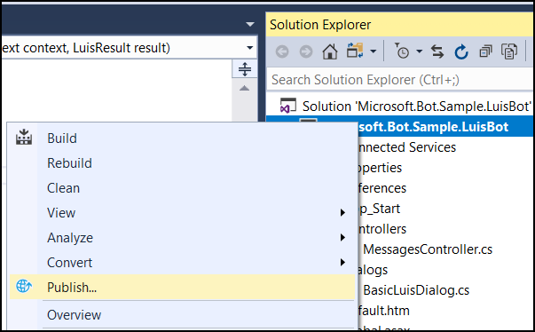

On the **Publish** page, click `Create new profile`.


> [!NOTE]
> If you receive an error message that the specified path or file name is too long, delete the ...\obj\Release\Package\PackageTmp folder from your project.

On the **Pick a publish target** page, select `Microsoft Azure App Service` and `Select Existing`, and then click `Publish`.

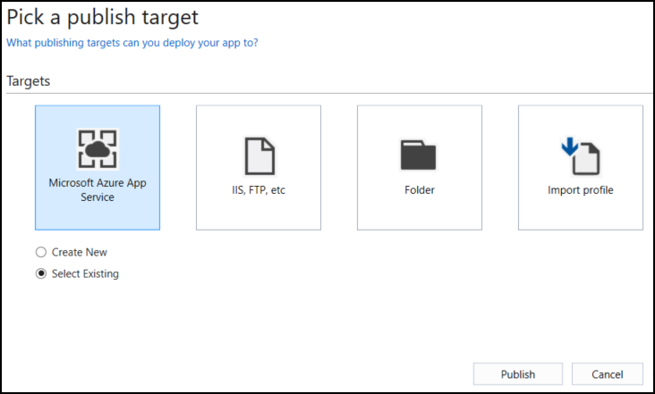

On the **App Service** page, select the Azure app service associated with your bot.

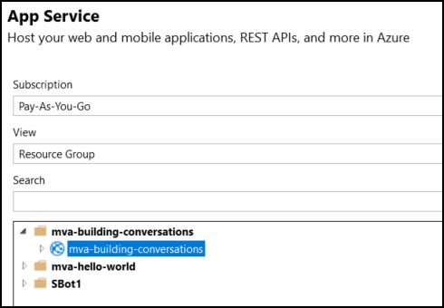

Visual Studio returns to the **Publish** page. Click `Publish` to deploy the revised bot to your Azure portal.

To view the updated code on the Azure portal, open the bot, click `Build` and then **Open online code editor**.

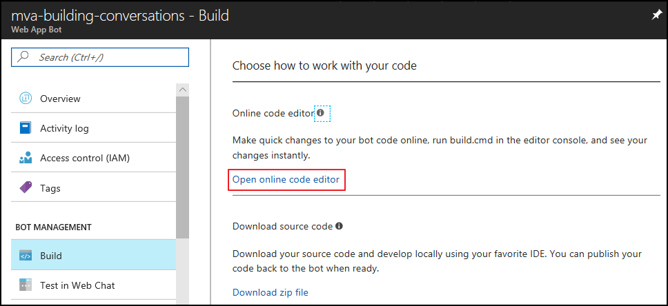

Then open the *BasicLuisDialog.cs* module.

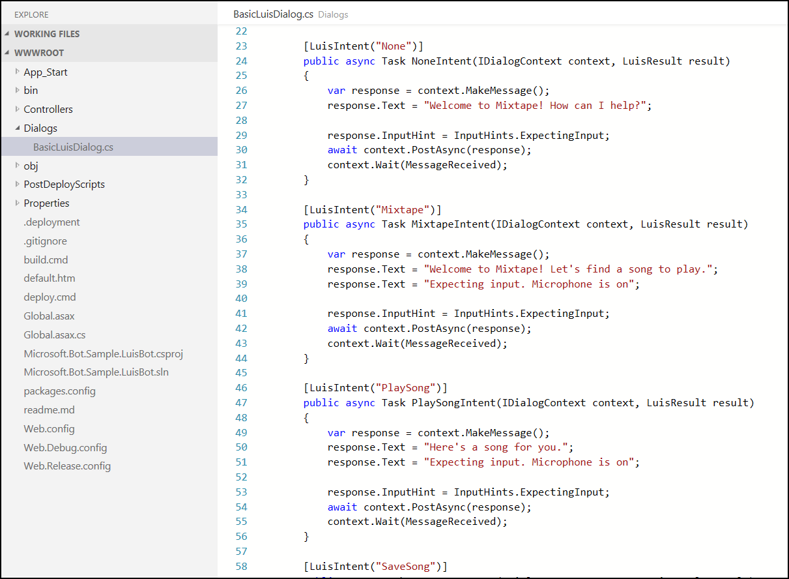

To test the revised bot, click `Test in Web Chat`, and then type a message in the prompt.

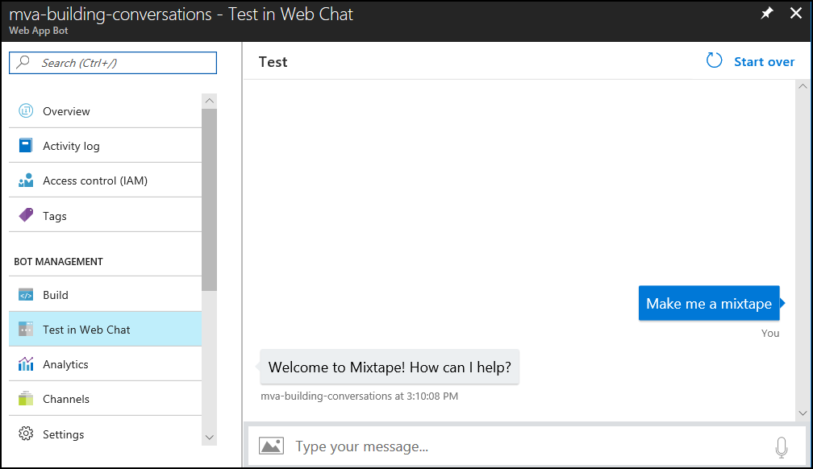

## Step 5 - Connect your LUIS bot to the Cortana Channel

Once you have created a LUIS bot, connect it to the Cortana channel to make it a Cortana skill.

In the Azure Portal, click the Channels tab to view the available channels, and then click the Cortana channel.

On the Configure Cortana page, scroll down to the **Discovery and Management** section and click `Manage`. Click the **Publish** menu tab and then `Publish to self` to open the channel configuration settings. This is where you specify both the display name and invocation name, and (optionally) an icon for the skill. Cortana uses the invocation name you specify to invoke the skill.

To test your new skill, direct Cortana to invoke the skill using the invocation name you specified.
