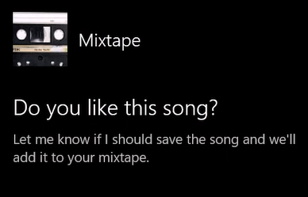

# Adding visual elements to Cortana skills

If you are creating a Cortana skill for a device with a screen, such as a PC or mobile device, you should consider the skill's visual  interface. In [Adding audio to Cortana skills](./mva41-streaming-audio.md), you learned how to use Speech Synthesis Markup Language (SSML) to customize speech and embed short audio clips, and how to use an Audio card to stream audio. In this module you'll see how to extend the **Mixtape** skill to add visual elements.

As you consider your Cortana skill's visual interface, keep in mind the following guidelines:

* The visual interface should complement the audio interface. For example, when the Mixtape skill audio plays a song, the skill could display a visual interface that asks the user questions about the song or provides additional information.
* The visual interface should simplify a complex task rather than add to the complexity. 
* Don't assume the user is looking at the screen. The device may have a screen, but the user may be across the room talking to the device. You may need to prompt the user to look at the screen.

## Step 1 - Add a visual element with text and an image to your skill

You can add a variety of visual interface elements, or *cards*, to your Cortana skill. The Bot Framework supports the following types of cards:

* Adaptive card - A customizable card that can contain any combination of text, speech, images, buttons, and input fields.
* Hero card - A card with a single large image, title, text, and buttons.
* Thumbnail card - A card with a single small image, title, text, and buttons.
* Receipt card - A card that contains an invoice or receipt.
* SignIn card - A card that lets the user sign-in to a service that the skill uses.

For more information about Bot Framework cards, see [Add rich card attachments to messages](https://docs.microsoft.com/azure/bot-service/dotnet/bot-builder-dotnet-add-rich-card-attachments?view=azure-bot-service-3.0) for .NET or [Add rich card attachments to messages](https://docs.microsoft.com/azure/bot-service/nodejs/bot-builder-nodejs-send-rich-cards?view=azure-bot-service-3.0) for Node.js. 

To add a visual interface element that displays a title heading and text to the Mixtape skill, add a Hero card. For example, revise the Mixtape skill's **PlaySongIntent** method as follows:

```csharp
public async Task PlaySongIntent(IDialogContext context, LuisResult result)
{
    var response = context.MakeMessage();

    HeroCard visuals = new HeroCard
    {
    Title = "Do you like this song?",
        Text = "Let me know if I should save the song and we'll add it to your mixtape."
    };

    AudioCard card = new AudioCard
    { 
    Media = new MediaUrl[] { new MediaUrl("https://myaudio.azurewebsites.net/song.mp3") }
    };

    response.Attachments.Add(visuals.ToAttachment());
    response.Attachments.Add(card.ToAttachment());

    response.InputHint = InputHints.ExpectingInput;
    await context.PostAsync(response);
    context.Wait(MessageReceived);
}
```

Because you are displaying text on the Hero card, the initial *response.Text* entry is unnecessary and can be deleted. Instead, the code creates a Hero card that displays a title and text. 

You can then add the Hero card as an attachment to the Cortana response, as you did with the Audio card in [Adding audio to Cortana skills](./mva41-streaming-audio.md).

## Step 2 - Test the revised skill

Before you can test the revised skill, you must republish it. If you are working with the Microsoft Azure App Service Editor or in Visual Studio, follow the redeployment steps in [Create your first Cortana skill](./mva22-hello-world.md) or [Building conversations](./mva32-building-conversations.md).

To test your revised skill, direct Cortana to invoke the skill using the invocation name you specified. Cortana responds with the text you specified and displays the Hero card containing the title and text you specified.


 