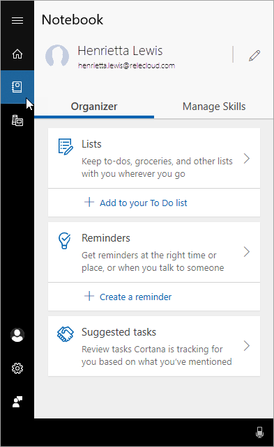

# Understanding Cortana's user profile data

In previous modules, you learned how to build conversation into your Cortana skill, how to use audio and visual elements, and how to launch apps or websites from your skill. In this module, you'll learn the basics about Cortana's user profile data, which you'll use in the next module to customize your Cortana skill.

Your user profile information can be found in the Cortana Notebook, which you can view by clicking the Notebook icon in the Cortana canvas.

You can view a variety of information in the Cortana Notebook. For example, you can see a list of your Cortana skills, or your preferences for how Cortana manages commute and traffic information.

You can also update many user profile items. For example, you can manage different lists, or add a reminder based on time, place, or a contact that you've called.

When you are developing a Cortana skill, you can customize the skill to the user by including information from the user profile. For example, with a user's consent, you can customize your skill to include the user's name, email address, or location.

For more information about user profile and contextual information, see [Get the user's profile and contextual information](./get-user-profile-context.md). 

For reference information on the user profile entities you can use in code when you are developing your Cortana skill, see [Cortana user profile and contextual information reference](./user-profile-contextual-info.md).
