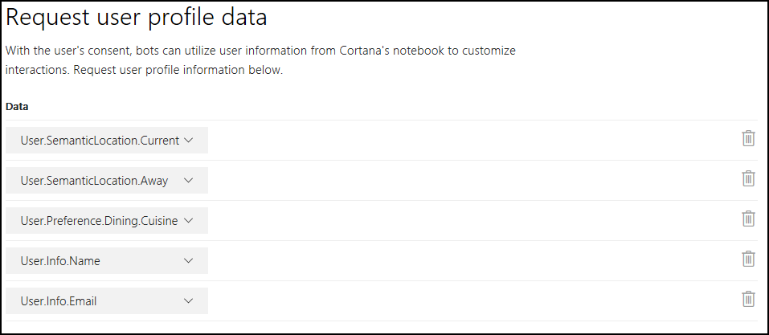
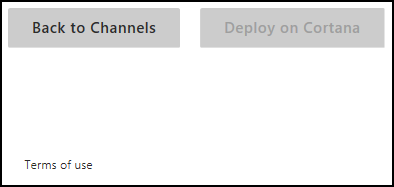

# Default Settings

After configuring the Cortana channel for your skill, it's automatically deployed to **Default Settings**. Deploying to **Default Settings** makes the skill available to you only, so you can thoroughly test it before deploying it to one of the other environments.

For more information about configuring the Cortana channel, visit the [Connect a bot to Cortana](https://docs.microsoft.com/azure/bot-service/bot-service-channel-connect-cortana?view=azure-bot-service-3.0) page.


1. On the *Configure Cortana* page, under the **Default Settings** section, enter the following information.

    Complete the required fields (marked with an asterisk).

    For more information about the bot configuration fields, visit the [Connect a bot to Cortana](https://docs.microsoft.com/azure/bot-service/bot-service-channel-connect-cortana) page.

    1. **Skill information** section

    

    * `Skill icon`: Click on the `Upload icon` button and select an icon for your Cortana skill.
    * `Display name`: The value is limited to 30 characters.
    * `Invocation name`: The name used to invoke your Cortana skill. This value must be unique across Cortana (all Cortana skills).

        For more information about invocation naming, visit the [Invocation Name Guidelines](./cortana-invocation-guidelines.md) page.

    1. Manage user identity through Connected Services
    

        `Cortana should manage my user's identity`: If you select this option, then you must complete the following fields.

        

    * `When should Cortana prompt for a user to sign in?`
        * `Sign in at invocation`: The user signs in once, and the authorization token will be passed as needed.
        * `Sign in when required`: The user will be asked to sign in whenever necessary.

    * `Account name`: The name of your Account.

    * `Client ID for third-party services`: The application ID of your bot.

        If you use a Microsoft service, the you get your application ID on the [Microsoft Application Registration Portal](https://apps.dev.microsoft.com/#/appList) page. Click the name of your BotFramework bot, listed under the **My Applications** section.

    * `Space-separated list of scopes`: The list of scopes, separated by spaces.
    * `Authorization URL`: The authorization URL of your OAuth 2.0 provider.

        If you use a Microsoft service, then the authorization URL is:

        ```url
        https://login.microsoftonline.com/common/oauth2/v2.0/authorize
        ```

    * `Token options`: Possible values are `GET` or `POST`. Unless you have specific reasons to use GET, you should use POST.
    * `Grant type`: Possible values are `Authorization code` or `Implicit`.
    * `Token URL`: The token URL of your OAuth 2.0 provider.

        If you are using a Microsoft service, then set to the following value.

        ```url
        https://login.microsoftonline.com/common/oauth2/v2.0/token
        ```

    * `Client secret/password for third party services`: Your bot's password.  If you're using Microsoft Identity Service, then the password is generated when you register your bot in the *Microsoft Application Registration* portal.

        >[!IMPORTANT]
        > The password (client secret) is displayed only once. When you create your bot, it's shown under the **Application Secrets** section of the [Microsoft Application Registration](https://apps.dev.microsoft.com/#/appList) portal.
        >
        > If you don't know the password, you'll need to create a new one by clicking on the `Generate New password` button.

    * `Client authorization scheme`: If you don't know your client authorization scheme, use  the default option (`HTTP Basic (Recommended)`).

    * `This skill's Connected Service requires intranet access to authenticate users (leave this unchecked if you are unsure).` Check this only if your app requires access to an intranet.

    1. Request user profile data

        

        Click on **Add a user profile request** and select the user profile information from the drop-down menu. Repeat to select additional user profile data.

        >[!IMPORTANT]
        > You are allowed to collect user profile data only to add to your skill's functionality. See section [2.5 Personal Information](./skill-review-guidelines.md#25-personal-information) in the [Cortana skills certification requirements page](./skill-review-guidelines.md).

        

        >[!TIP]
        > For more information about the bot configuration fields, visit the  [Connect a bot to Cortana](https://docs.microsoft.com/azure/bot-service/bot-service-channel-connect-cortana) page.

1. After all of the required fields are completed, you can click on the `Deploy on Cortana` button.

 <!--    

     -->

You can confirm that your Cortana skill is deployed on the Bot Framework portal or Azure portal page by logging in with the same Microsoft account (MSA) that you registered in the *Bot Framework* portal.

