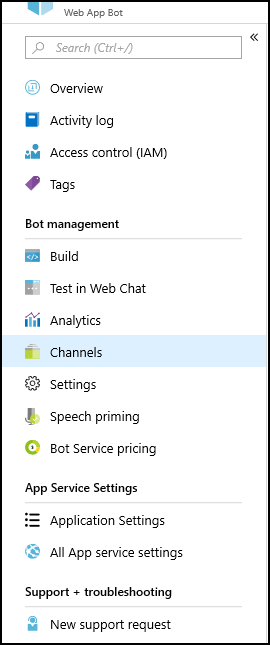
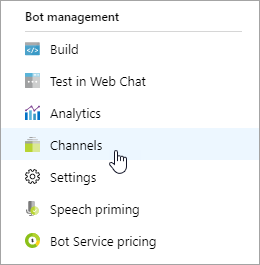
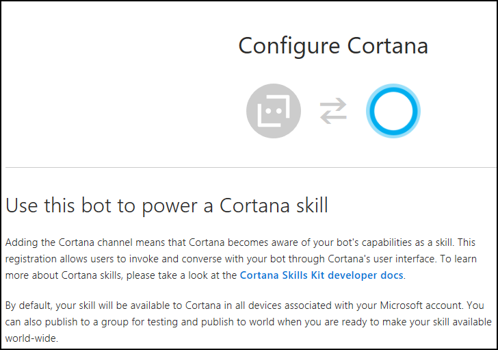

# Publishing Cortana skills

>[!NOTE]
> This article describes how to publish a Cortana skill. You should already have created a skill before proceeding.
>
> If you haven't created one yet, visit the [Create your first skill](./get-started.md) page.

<!-- Deploy your Cortana skill to each of the three deployment groups. -->
When you create your skill, it will automatically be deployed using the default settings:

* [Default Settings](#default-settings)

This will allow you to test your skill. You will be the only person who has access to your skill at this point

When you're ready to allow others to see your skill, you will first need get approval by filling out the developer settings:

* [Developer Settings](#developer-settings)

Once you've been approved, you can deploy your skill using Group or World settings:

* [Test Group Settings](#test-group-settings)
* [World Settings](#world-settings)

All deployment groups contain the same instance of your Cortana skill. **[Not sure what this means.]**

Two identifiers are assigned to your Cortana skill.

* `skillId`:  The identifier (ID) of your Cortana skill is unique per deployment group. If your skill checks the ID, then verify the IDs are different for each group. Use the ID of your Cortana skill if you want to turn on additional logging for the group environment.
* `skillProductId`: The product ID of your Cortana skill is unique across deployment groups.

Cortana passes these IDs in the channel information of the message.

## Cortana Configuration Fields

Follow these instructions to access the Cortana Configuration page and update each of the parameters for your Cortana skill.

1. Sign into the [BotFramework](https://dev.botframework.com) portal and click on the `My bots` link.

1. On the *My bots* page, click the name of your bot.

    

1. On the *Microsoft Azure* portal, in your Web App Bot blade, under the *Bot Management* section, click on the `Channels` icon.

    

1. On the *Connect to channels* page, under the **Add a featured channel** section, click on the `Configure Cortana Channel` icon.

    

## Default Settings

The default settings are described on the [Default Settings](./pub-default-settings.md) page.

## Developer Settings

The developer settings are described on the [Developer Settings](./pub-developer-settings.md) page.

## Test Group Settings

The settings for the test group are shown on the [Test Group](./pub-test-settings.md) page.

## World Settings

See the [World Settings](./pub-world-settings.md) page for details on allowing everyone to access your skill.

### Withdrawing Your Submission

After you submit your Cortana skill, it's locked while the Certification Team is reviewing it. If you want to make changes to your skill, click on the `Withdraw your submission` button.

You may withdraw your Cortana skill only during the following stages.

- Prior to start of review
- During review **[Is this still true?]**

Once the skill is approved and available to the world, the `Withdraw Your Submission` button is no longer available. If you want to withdraw your skill after approval, you must either delete the Cortana channel or write to us (skillsup@microsoft.com) asking us to take the skill down.

All the properties entered in **World Settings** are saved if you withdraw the skill. You may update the publishing properties of your Cortana skill and submit it again for review and certification.

### Common Reasons for Review Failure

If you read and adhere to the [review guidelines](./skill-review-guidelines.md), then your skill should pass the review.

Some common reasons why a Cortana skill fails the review are:

- The invocation name does not meet policy requirements. See [Invocation name guidelines](https://docs.microsoft.com/en-us/cortana/skills/cortana-invocation-guidelines) for help.

- Your submission does not provide sample invocation phrases.  You must provide at least three sample invocation phrases that demonstrate your Cortana skill. Each of the samples should use a different phrase, beginning with `ask`, `open`, `tell`, etc. See [Invocation phrases](https://docs.microsoft.com/en-us/cortana/skills/cortana-invocation-guidelines#invocation-phrases) for a list of available invocation phrases.

- You provide sample phrases with one or more of the following issues.

  + The phrase doesn't include a launch word (`ask`, `tell`, and so on) or an invocation name. For example, for a skill called **MyEvents**, these would be incorrect:

      + "MyEvents update": Missing the launch word.
      + "Ask for an update": Missing the invocation name.

  + The samples do not work as expected or described. Before submitting your skill, you should ensure that the invocation phrases work as expected. Ideally, you should provide enough samples to demonstrate all key features.
  
  + The skill does not provide support for help. Most first-time users will ask the skill for help (usually by saying "Help"). If a user asks for help, then your skill must tell the user how to use the skill.
  
      Your skill should also prompt the user for correct input if it cannot respond to what the user just entered.
  
      Example: If your skill involved checking stock prices, and the user failed to provide a stock name, your help could be "Please say the name of a stock. For example, say Contoso."
  
  + Your skill infringes on the intellectual property (IP) of another company.
  
      The name and invocation name of your Cortana skill should not consist of any trademarked or copyrighted words unless you have permission from the owner. You must ensure that you have the right to share the content that your skill provides, and you must ensure that your skill doesn't make use of any unlicensed or pirated audio or visual content.

### Delete Channel

Deleting a Cortana skill involves deleting the channel inside the BotFramework portal.  To be able to delete the Cortana channel on a bot, the skill must not be currently published to **World**.

If you need to delete a Cortana skill that is published to **World**, then you must contact the Cortana Certification Team. If a skill is under review by the team, then you must first withdraw your submission before deleting the Cortana channel. See the [Withdrawing Your Submission](#withdrawing-your-submission) section.

If your skill has not been published to **World**, you can delete the channel on the *Configure Cortana* page. At the bottom of all sections, click the `Delete Channel` button.

