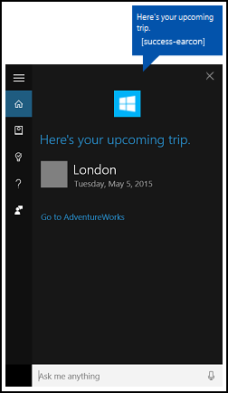
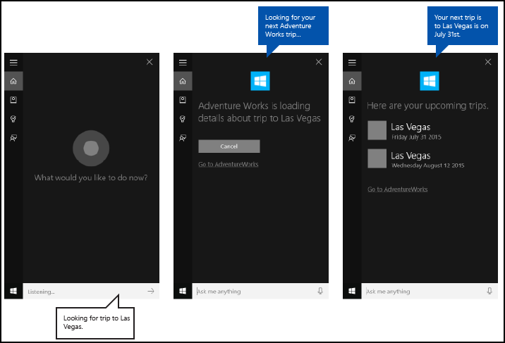
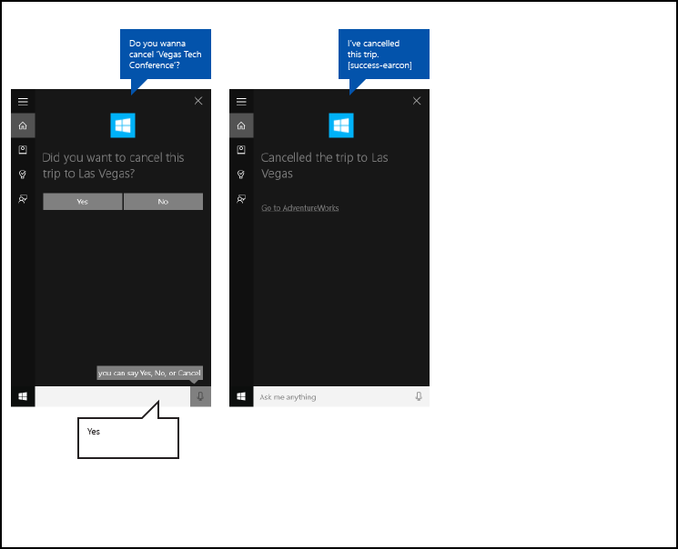

# Interact with a background app in Cortana

Enable user interaction with a background app, through speech and text input in the **Cortana** canvas, while executing a voice command.


**Important APIs**

-   [**Windows.ApplicationModel.VoiceCommands**](https://msdn.microsoft.com/library/windows/apps/dn706594)
-   [**Voice Command Definition (VCD) elements and attributes v1.2**](https://msdn.microsoft.com/library/windows/apps/dn706593)

Cortana supports a complete turn-by-turn workflow with your app. This workflow is defined by your app, and can support functionality such as: 

-   Successful completion
-   Hand-off
-   Progress
-   Confirmation
-   Disambiguation
-   Error

**Prerequisites**

This topic builds on [Launch a background app with voice commands in Cortana](launch-a-background-app-with-voice-commands-in-cortana.md). We continue here to demonstrate features with a trip planning and management app named **Adventure Works**.

If you're new to developing Universal Windows Platform (UWP) apps, have a look through these topics to get familiar with the technologies discussed here.

-   [Create your first app](https://msdn.microsoft.com/library/windows/apps/bg124288)
-   Learn about events with [Events and routed events overview](https://msdn.microsoft.com/library/windows/apps/mt185584)

**User experience guidelines**

See [Cortana design guidelines](https://msdn.microsoft.com/library/windows/apps/dn974233) for info about how to integrate your app with **Cortana** and [Speech design guidelines](https://msdn.microsoft.com/library/windows/apps/dn596121) for helpful tips on designing a useful and engaging speech-enabled app.

## <span id="Feedback_strings"></span><span id="feedback_strings"></span><span id="FEEDBACK_STRINGS"></span>Feedback strings

Compose the feedback strings that are both displayed and spoken by **Cortana**.

The [Cortana design guidelines](https://msdn.microsoft.com/library/windows/apps/dn974233)provides recommendations on composing strings for **Cortana**.

## <span id="Feedback_strings"></span><span id="feedback_strings"></span><span id="FEEDBACK_STRINGS"></span>Feedback strings

Content cards can provide additional context for the user and help you keep feedback strings concise.

**Cortana** supports the following content card templates (only one template can be used on the completion screen):

    -   Title only
    -   Title with up to three lines of text
    -   Title with image
    -   Title with image and up to three lines of text

The image can be:

    -   68w x 68h
    -   68w x 92h
    -   280w x 140h

You can also let users launch your app in the foreground by clicking either a card or the text link to your app.

## <span id="Completion_screen"></span><span id="completion_screen"></span><span id="COMPLETION_SCREEN"></span>Completion screen

A completion screen provides the user with information about the completed voice command task.

Tasks that take less than 500 milliseconds for your app to respond, and require no additional information from the user, are completed without further interaction with  **Cortana**. Cortana simply displays the completion screen.

Here, we use the **Adventure Works** app to show the completion screen for a voice command request to display upcoming trips to London. 



The voice command is defined in AdventureWorksCommands.xml:
```
<Command Name="whenIsTripToDestination">
  <Example> When is my trip to Las Vegas?</Example>
  <ListenFor RequireAppName="BeforeOrAfterPhrase"> when is [my] trip to {destination}</ListenFor>
  <ListenFor RequireAppName="ExplicitlySpecified"> when is [my] {builtin:AppName} trip to {destination} </ListenFor>
  <Feedback> Looking for trip to {destination}</Feedback>
  <VoiceCommandService Target="AdventureWorksVoiceCommandService"/>
</Command>
```

AdventureWorksVoiceCommandService.cs contains the completion message method:

```csharp
/// <summary>
/// Show details for a single trip, if the trip can be found. 
/// This demonstrates a simple response flow in Cortana.
/// </summary>
/// <param name="destination">The destination, expected to be in the phrase list.</param>
private async Task SendCompletionMessageForDestination(string destination)
{
	// If this operation is expected to take longer than 0.5 seconds, the task must
	// supply a progress response to Cortana before starting the operation, and
	// updates must be provided at least every 5 seconds.
	string loadingTripToDestination = string.Format(
			   cortanaResourceMap.GetValue("LoadingTripToDestination", cortanaContext).ValueAsString,
			   destination);
	await ShowProgressScreen(loadingTripToDestination);
	Model.TripStore store = new Model.TripStore();
	await store.LoadTrips();

	// Query for the specified trip. 
    // The destination should be in the phrase list. However, there might be  
    // multiple trips to the destination. We pick the first.
	IEnumerable<Model.Trip> trips = store.Trips.Where(p => p.Destination == destination);

	var userMessage = new VoiceCommandUserMessage();
	var destinationsContentTiles = new List<VoiceCommandContentTile>();
	if (trips.Count() == 0)
	{
		string foundNoTripToDestination = string.Format(
			   cortanaResourceMap.GetValue("FoundNoTripToDestination", cortanaContext).ValueAsString,
			   destination);
		userMessage.DisplayMessage = foundNoTripToDestination;
		userMessage.SpokenMessage = foundNoTripToDestination;
	}
	else
	{
		// Set plural or singular title.
		string message = "";
		if (trips.Count() > 1)
		{
			message = cortanaResourceMap.GetValue("PluralUpcomingTrips", cortanaContext).ValueAsString;
		}
		else
		{
			message = cortanaResourceMap.GetValue("SingularUpcomingTrip", cortanaContext).ValueAsString;
		}
		userMessage.DisplayMessage = message;
		userMessage.SpokenMessage = message;

		// Define a tile for each destination.
		foreach (Model.Trip trip in trips)
		{
			int i = 1;
			
			var destinationTile = new VoiceCommandContentTile();

			destinationTile.ContentTileType = VoiceCommandContentTileType.TitleWith68x68IconAndText;
			destinationTile.Image = await StorageFile.GetFileFromApplicationUriAsync(new Uri("ms-appx:///AdventureWorks.VoiceCommands/Images/GreyTile.png"));

			destinationTile.AppLaunchArgument = trip.Destination;
			destinationTile.Title = trip.Destination;
			if (trip.StartDate != null)
			{
				destinationTile.TextLine1 = trip.StartDate.Value.ToString(dateFormatInfo.LongDatePattern);
			}
			else
			{
				destinationTile.TextLine1 = trip.Destination + " " + i;
			}

			destinationsContentTiles.Add(destinationTile);
			i++;
		}
	}

	var response = VoiceCommandResponse.CreateResponse(userMessage, destinationsContentTiles);

	if (trips.Count() > 0)
	{
		response.AppLaunchArgument = destination;
	}

	await voiceServiceConnection.ReportSuccessAsync(response);
}
```

## <span id="Hand-off_screen"></span><span id="hand-off_screen"></span><span id="HAND-OFF_SCREEN"></span>Hand-off screen

Once a voice command is recognized, **Cortana** must call ReportSuccessAsync and present feedback within approximately 500If the app service cannot complete the action specified by the voice command within 500ms, **Cortana** presents a hand-off screen that is shown until your app calls ReportSuccessAsync, or for up to 5 seconds.

If the app service doesn’t call ReportSuccessAsync, or any other VoiceCommandServiceConnection method, the user receives an error message and the app service call is cancelled.

Here's an example of a hand-off screen for the **Adventure Works** app. In this example, a user has queried **Cortana** for upcoming trips. The hand-off screen includes a message customized with the app service name, an icon, and a **Feedback** string. 

[!NOTE] You can declare a **Feedback** string in the VCD file. This string does not affect the UI text displayed on the Cortana canvas, it only affects the text spoken by **Cortana**.




## <span id="Progress_screen"></span><span id="progress_screen"></span><span id="PROGRESS_SCREEN"></span>Progress screen


If the app service takes more than 500ms to call ReportSuccessAsync, **Cortana** provides the user with a progress screen. The app icon is displayed, and you must provide both GUI and TTS progress strings to indicate that the task is being actively handled.

**Cortana** shows a progress screen for a maximum of 5 seconds. After 5 seconds, **Cortana** presents the user with an error message and the app service is closed. If the app service needs more than 5 seconds to complete the action, it can continue to update **Cortana** with progress screens.

Here's an example of a progress screen for the **Adventure Works** app. In this example, a user has canceled a trip to Las Vegas. The progress screen includes a message customized for the action, an icon, and a content tile with information about the trip being canceled.


AdventureWorksVoiceCommandService.cs contains the following progress message method, which calls [**ReportProgressAsync**](https://msdn.microsoft.com/library/windows/apps/dn706579) to show the progress screen in **Cortana**.


```    CSharp
/// <summary>
/// Show a progress screen. These should be posted at least every 5 seconds for a 
/// long-running operation.
/// </summary>
/// <param name="message">The message to display, relating to the task being performed.</param>
/// <returns></returns>
private async Task ShowProgressScreen(string message)
{
	var userProgressMessage = new VoiceCommandUserMessage();
	userProgressMessage.DisplayMessage = userProgressMessage.SpokenMessage = message;

	VoiceCommandResponse response = VoiceCommandResponse.CreateResponse(userProgressMessage);
	await voiceServiceConnection.ReportProgressAsync(response);
}
```

## <span id="Confirmation_screen"></span><span id="confirmation_screen"></span><span id="CONFIRMATION_SCREEN"></span>Confirmation screen


When an action specified by a voice command is irreversible, has a significant impact, or the recognition confidence is not high, an app service can request confirmation.

Here's an example of a confirmation screen for the **Adventure Works** app. In this example, a user has instructed the app service to cancel a trip to Las Vegas through **Cortana**. The app service has provided **Cortana** with a confirmation screen that prompts the user for a yes or no answer before canceling the trip.

If the user says something other than "Yes" or "No", **Cortana** cannot determine the answer to the question. In this case, **Cortana** prompts the user with a similar question provided by the app service.

On the second prompt, if the user still doesn’t say "Yes" or "No", **Cortana** prompts the user a third time with the same question prefixed with an apology. If the user still doesn’t say "Yes" or "No", **Cortana** stops listening for voice input and asks the user to tap one of the buttons instead.

The confirmation screen includes a message customized for the action, an icon, and a content tile with information about the trip being canceled.



AdventureWorksVoiceCommandService.cs contains the following trip cancellation method, which calls [**RequestConfirmationAsync**](https://msdn.microsoft.com/library/windows/apps/dn706582) to show a confirmation screen in **Cortana**.

```    CSharp
/// <summary>
/// Handle the Trip Cancellation task. This task demonstrates how to prompt a user
/// for confirmation of an operation, show users a progress screen while performing
/// a long-running task, and show a completion screen.
/// </summary>
/// <param name="destination">The name of a destination.</param>
/// <returns></returns>
private async Task SendCompletionMessageForCancellation(string destination)
{
	// Begin loading data to search for the target store. 
    // Consider inserting a progress screen here, in order to prevent Cortana from timing out. 
	string progressScreenString = string.Format(
		cortanaResourceMap.GetValue("ProgressLookingForTripToDest", cortanaContext).ValueAsString,
		destination);
	await ShowProgressScreen(progressScreenString);

	Model.TripStore store = new Model.TripStore();
	await store.LoadTrips();

	IEnumerable<Model.Trip> trips = store.Trips.Where(p => p.Destination == destination);
	Model.Trip trip = null;
	if (trips.Count() > 1)
	{
		// If there is more than one trip, provide a disambiguation screen.
		// However, if a significant number of items are returned, you might want to 
		// just display a link to your app and provide a deeper search experience.
		string disambiguationDestinationString = string.Format(
			cortanaResourceMap.GetValue("DisambiguationWhichTripToDest", cortanaContext).ValueAsString,
			destination);
		string disambiguationRepeatString = cortanaResourceMap.GetValue("DisambiguationRepeat", cortanaContext).ValueAsString;
		trip = await DisambiguateTrips(trips, disambiguationDestinationString, disambiguationRepeatString);
	}
	else
	{
		trip = trips.FirstOrDefault();
	}

	var userPrompt = new VoiceCommandUserMessage();
	
	VoiceCommandResponse response;
	if (trip == null)
	{
		var userMessage = new VoiceCommandUserMessage();
		string noSuchTripToDestination = string.Format(
			cortanaResourceMap.GetValue("NoSuchTripToDestination", cortanaContext).ValueAsString,
			destination);
		userMessage.DisplayMessage = userMessage.SpokenMessage = noSuchTripToDestination;

		response = VoiceCommandResponse.CreateResponse(userMessage);
		await voiceServiceConnection.ReportSuccessAsync(response);
	}
	else
	{
		// Prompt the user for confirmation that this is the correct trip to cancel.
		string cancelTripToDestination = string.Format(
			cortanaResourceMap.GetValue("CancelTripToDestination", cortanaContext).ValueAsString,
			destination);
		userPrompt.DisplayMessage = userPrompt.SpokenMessage = cancelTripToDestination;
		var userReprompt = new VoiceCommandUserMessage();
		string confirmCancelTripToDestination = string.Format(
			cortanaResourceMap.GetValue("ConfirmCancelTripToDestination", cortanaContext).ValueAsString,
			destination);
		userReprompt.DisplayMessage = userReprompt.SpokenMessage = confirmCancelTripToDestination;
		
		response = VoiceCommandResponse.CreateResponseForPrompt(userPrompt, userReprompt);

		var voiceCommandConfirmation = await voiceServiceConnection.RequestConfirmationAsync(response);

		// If RequestConfirmationAsync returns null, Cortana has likely been dismissed.
		if (voiceCommandConfirmation != null)
		{
			if (voiceCommandConfirmation.Confirmed == true)
			{
				string cancellingTripToDestination = string.Format(
			   cortanaResourceMap.GetValue("CancellingTripToDestination", cortanaContext).ValueAsString,
			   destination);
				await ShowProgressScreen(cancellingTripToDestination);

				// Perform the operation to remove the trip from app data. 
				// As the background task runs within the app package of the installed app,
				// we can access local files belonging to the app without issue.
				await store.DeleteTrip(trip);

				// Provide a completion message to the user.
				var userMessage = new VoiceCommandUserMessage();
				string cancelledTripToDestination = string.Format(
					cortanaResourceMap.GetValue("CancelledTripToDestination", cortanaContext).ValueAsString,
					destination);
				userMessage.DisplayMessage = userMessage.SpokenMessage = cancelledTripToDestination;
				response = VoiceCommandResponse.CreateResponse(userMessage);
				await voiceServiceConnection.ReportSuccessAsync(response);
			}
			else
			{
				// Confirm no action for the user.
				var userMessage = new VoiceCommandUserMessage();
				string keepingTripToDestination = string.Format(
					cortanaResourceMap.GetValue("KeepingTripToDestination", cortanaContext).ValueAsString,
					destination);
				userMessage.DisplayMessage = userMessage.SpokenMessage = keepingTripToDestination;

				response = VoiceCommandResponse.CreateResponse(userMessage);
				await voiceServiceConnection.ReportSuccessAsync(response);
			}
		}
	}
}
```

## <span id="Disambiguation_screen"></span><span id="disambiguation_screen"></span><span id="DISAMBIGUATION_SCREEN"></span>Disambiguation screen


When an action specified by a voice command has more than one possible outcome, an app service can request more info from the user.

Here's an example of a disambiguation screen for the **Adventure Works** app. In this example, a user has instructed the app service to cancel a trip to Las Vegas through **Cortana**. However, the user has two trips to Las Vegas on different dates and the app service cannot complete the action without the user selecting the intended trip.

The app service provides **Cortana** with a disambiguation screen that prompts the user to make a selection from a list of matching trips, before it cancels any.

In this case, **Cortana** prompts the user with a similar question provided by the app service.

On the second prompt, if the user still doesn’t say something that can be used to identify the selection, **Cortana** prompts the user a third time with the same question prefixed with an apology. If the user still doesn’t say something that can be used to identify the selection, **Cortana** stops listening for voice input and asks the user to tap one of the buttons instead.

The disambiguation screen includes a message customized for the action, an icon, and a content tile with information about the trip being canceled.


AdventureWorksVoiceCommandService.cs contains the following trip cancellation method, which calls [**RequestDisambiguationAsync**](https://msdn.microsoft.com/library/windows/apps/dn706583) to show the disambiguation screen in **Cortana**.

```csharp
/// <summary>
/// Provide the user with a way to identify which trip to cancel. 
/// </summary>
/// <param name="trips">The set of trips</param>
/// <param name="disambiguationMessage">The initial disambiguation message</param>
/// <param name="secondDisambiguationMessage">Repeat prompt retry message</param>
private async Task<Model.Trip> DisambiguateTrips(IEnumerable<Model.Trip> trips, string disambiguationMessage, string secondDisambiguationMessage)
{
	// Create the first prompt message.
	var userPrompt = new VoiceCommandUserMessage();
	userPrompt.DisplayMessage =
		userPrompt.SpokenMessage = disambiguationMessage;

	// Create a re-prompt message if the user responds with an out-of-grammar response.
	var userReprompt = new VoiceCommandUserMessage();
	userReprompt.DisplayMessage =
		userReprompt.SpokenMessage = secondDisambiguationMessage;

	// Create card for each item. 
	var destinationContentTiles = new List<VoiceCommandContentTile>();
	int i = 1;
	foreach (Model.Trip trip in trips)
	{
		var destinationTile = new VoiceCommandContentTile();

		destinationTile.ContentTileType = VoiceCommandContentTileType.TitleWith68x68IconAndText;
		destinationTile.Image = await StorageFile.GetFileFromApplicationUriAsync(new Uri("ms-appx:///AdventureWorks.VoiceCommands/Images/GreyTile.png"));
		
		// The AppContext can be any arbitrary object.
		destinationTile.AppContext = trip;
		string dateFormat = "";
		if (trip.StartDate != null)
		{
			dateFormat = trip.StartDate.Value.ToString(dateFormatInfo.LongDatePattern);
		}
		else
		{
			// The app allows a trip to have no date.
            // However, the choices must be unique so they can be distinguished.
            // Here, we add a number to identify them.
			dateFormat = string.Format("{0}", i);
		} 

		destinationTile.Title = trip.Destination + " " + dateFormat;
		destinationTile.TextLine1 = trip.Description;

		destinationContentTiles.Add(destinationTile);
		i++;
	}

	// Cortana handles re-prompting if no valid response.
	var response = VoiceCommandResponse.CreateResponseForPrompt(userPrompt, userReprompt, destinationContentTiles);

	// If cortana is dismissed in this operation, null is returned.
	var voiceCommandDisambiguationResult = await
		voiceServiceConnection.RequestDisambiguationAsync(response);
	if (voiceCommandDisambiguationResult != null)
	{
		return (Model.Trip)voiceCommandDisambiguationResult.SelectedItem.AppContext;
	}

	return null;
}
```

## <span id="Error_screen"></span><span id="error_screen"></span><span id="ERROR_SCREEN"></span>Error screen


When an action specified by a voice command cannot be completed, an app service can provide an error screen.

Here's an example of an error screen for the **Adventure Works** app. In this example, a user has instructed the app service to cancel a trip to Las Vegas through **Cortana**. However, the user does not have any trips scheduled to Las Vegas.

The app service provides **Cortana** with an error screen that includes a message customized for the action, an icon, and the specific error message.

Call [**ReportFailureAsync**](https://msdn.microsoft.com/library/windows/apps/dn706578) to show the error screen in **Cortana**.

```csharp
var userMessage = new VoiceCommandUserMessage();
    userMessage.DisplayMessage = userMessage.SpokenMessage = 
      "Sorry, you don't have any trips to Las Vegas";
                
    var response = VoiceCommandResponse.CreateResponse(userMessage);

    response.AppLaunchArgument = "showUpcomingTrips";
    await voiceServiceConnection.ReportFailureAsync(response);
```

## <span id="related_topics"></span>Related articles


**Developers**
* [Voice commands](./vcd.md)
* [**VCD elements and attributes v1.2**](https://msdn.microsoft.com/library/windows/apps/dn706593)

**Designers**
* [Cortana design guidelines](https://msdn.microsoft.com/library/windows/apps/dn974233)
* [Speech design guidelines](https://msdn.microsoft.com/library/windows/apps/dn596121)

**Samples**
* [Cortana voice command sample](https://go.microsoft.com/fwlink/p/?LinkID=619899)
